Text Mining of the Sustainable Development Goals
================
Serge Morand for FutureHealthSEA
8/14/2018

Text Mining: an approach to reading the SDGs
--------------------------------------------

The interpretation and understanding of the Sustainable Development Goals (SDGs) can be greatly facilitated by quantitative techniques of text mining. These techniques make it possible to map the semantics used and to help build a qualitative analysis on objectified and quantified bases. Text mining allows us to identify the main terms contained in different texts (here in the different objectives and sub-objectives of the SDGs), to measure their occurrences and their associations (here within and between the various SDGs)

The R script here is based on several sources, the mains are <https://eight2late.wordpress.com/2015/05/27/a-gentle-introduction-to-text-mining-using-r/> and a nice introduction to text mining in R <https://www.tidytextmining.com/>

The titles, objectives and sub-objectives of each of the 17 SDGs can ben found at <https://sustainabledevelopment.un.org/post2015/transformingourworld>

The 17 SDGS (corpus of text files) are given in the folder "Text\_SDGs". Each file includes the title, objectives and sub-objectives of each SDG

``` r
# create a corpus with the library tm
library(tm)
```

    ## Loading required package: NLP

``` r
# create a corpus frame
docs <- Corpus(DirSource("./Text_SDGs"))

# create toSpace content transformer
toSpace <- content_transformer(function(x, pattern) {return (gsub(pattern, " ", x))})

# see list of functions to clean the corpus
getTransformations()
```

    ## [1] "removeNumbers"     "removePunctuation" "removeWords"      
    ## [4] "stemDocument"      "stripWhitespace"

``` r
# start to clean
# replace "-" / ":" ...  by " " using tm_map
docs <- tm_map(docs, toSpace, "-")
docs <- tm_map(docs, toSpace, ":")
docs <- tm_map(docs, toSpace, " -")
# replace all punctuation marks by " "
docs <- tm_map(docs, removePunctuation)

# transform to lower case (need to wrap in content_transformer)
docs <- tm_map(docs,content_transformer(tolower))

# strip digits (no need for content_transformer)
docs <- tm_map(docs, removeNumbers)

# remove stopwords using the standard list in tm
docs <- tm_map(docs, removeWords, stopwords("english"))

# compile meaningless words in myStopwords such as 'can', 'whose'
myStopwords <- c(stopwords("english"), "can","whose","however","may","part",
                 "also","one","first","three","four","will","within","first",
                 "still","always","thus","show","us","small","take","suggest","must",
                 "certain","allow","better","without","seem","great","face","lead",
                 "find","rather","of","and","in","end","per","least","all","as","at",
                 "year","less","low","well","particular","best")

# remove stopwords from corpus
docs <- tm_map(docs, removeWords, myStopwords)

# change words if necessary (NOT RUN)
# myCorpus <- tm_map(myCorpus, gsub, pattern = "miners", replacement = "mining")

# strip whitespace
docs <- tm_map(docs, stripWhitespace)

# inspect SDG1
writeLines(as.character(docs[[1]]))
```

    ## efbbbfend poverty forms everywhere eradicate extreme poverty people everywhere currently measured people living day reduce half proportion men women children ages living poverty dimensions according national definitions implement nationally appropriate social protection systems measures including floors achieve substantial coverage poor vulnerable ensure men women poor vulnerable equal rights economic resources access basic services ownership control land forms property inheritance natural resources appropriate new technology financial services including microfinance build resilience poor vulnerable situations reduce exposure vulnerability climate related extreme events economic social environmental shocks disasters ensure significant mobilization resources variety sources including enhanced development cooperation order provide adequate predictable means developing countries developed countries implement programmes policies poverty dimensions create sound policy frameworks national regional international levels based pro poor gender sensitive development strategies support accelerated investment poverty eradication actions

``` r
# inspect SDG2
writeLines(as.character(docs[[2]]))
```

    ## efbbbfend hunger achieve food security improved nutrition promote sustainable agriculture hunger ensure access people poor people vulnerable situations including infants safe nutritious sufficient food round forms malnutrition including achieving internationally agreed targets stunting wasting children years age address nutritional needs adolescent girls pregnant lactating women older persons double agricultural productivity incomes scale food producers women indigenous peoples family farmers pastoralists fishers including secure equal access land productive resources inputs knowledge financial services markets opportunities value addition non farm employment ensure sustainable food production systems implement resilient agricultural practices increase productivity production help maintain ecosystems strengthen capacity adaptation climate change extreme weather drought flooding disasters progressively improve land soil quality maintain genetic diversity seeds cultivated plants farmed domesticated animals related wild species including soundly managed diversified seed plant banks national regional international levels ensure access fair equitable sharing benefits arising utilization genetic resources associated traditional knowledge internationally agreed increase investment including enhanced international cooperation rural infrastructure agricultural research extension services technology development plant livestock gene banks order enhance agricultural productive capacity developing countries developed countries correct prevent trade restrictions distortions world agricultural markets including parallel elimination forms agricultural export subsidies export measures equivalent effect accordance mandate doha development round adopt measures ensure proper functioning food commodity markets derivatives facilitate timely access market information including food reserves order help limit extreme food price volatility

``` r
# transformation to corpora
docs <- tm_map(docs,stemDocument)

# coerce to a document-term matrix (DTM)
dtm <- DocumentTermMatrix(docs)
# inspect the document-term matrix
dtm
```

    ## <<DocumentTermMatrix (documents: 17, terms: 763)>>
    ## Non-/sparse entries: 1897/11074
    ## Sparsity           : 85%
    ## Maximal term length: 16
    ## Weighting          : term frequency (tf)

``` r
inspect(dtm[1:5,1:5])
```

    ## <<DocumentTermMatrix (documents: 5, terms: 5)>>
    ## Non-/sparse entries: 17/8
    ## Sparsity           : 32%
    ## Maximal term length: 7
    ## Weighting          : term frequency (tf)
    ## Sample             :
    ##     Terms
    ## Docs acceler access accord achiev action
    ##    1       1      1      1      1      1
    ##    2       0      4      1      2      0
    ##    3       0      5      1      1      0
    ##    4       0      3      0      1      0
    ##    5       0      2      2      1      2

``` r
# compute the frequence of each term
freq <- colSums(as.matrix(dtm))
# length should give the total number of terms
length(freq)
```

    ## [1] 763

``` r
# create sort order (descending)
ord <- order(freq,decreasing=TRUE)

# list the most and least frequently occurring terms
# inspect most frequently occurring terms
freq[head(ord)]
```

    ## develop countri  includ sustain  access   ensur 
    ##     128      84      62      62      39      34

``` r
#inspect least frequently occurring terms
freq[tail(ord)] 
```

    ##     set   simpl  stabil statist     tax    view 
    ##       1       1       1       1       1       1

``` r
# find the terms with a frequence of >= 50 citations in the corpus
findFreqTerms(dtm,lowfreq=50)
```

    ## [1] "countri" "develop" "includ"  "sustain"

``` r
# find the terms with a frequence of >= 50 citations in the corpus
findFreqTerms(dtm,lowfreq=20)
```

    ##  [1] "access"    "countri"   "develop"   "enhanc"    "ensur"    
    ##  [6] "implement" "includ"    "intern"    "nation"    "polici"   
    ## [11] "reduc"     "resourc"   "technolog" "capac"     "increas"  
    ## [16] "product"   "promot"    "sustain"   "global"

``` r
# find which terls are associated with the term "soil", with a correlation >= 0.3
findAssocs(dtm,"soil",0.3)
```

    ## $soil
    ##     prevent        doha      affect        aris     distort     drought 
    ##        0.80        0.67        0.67        0.66        0.66        0.66 
    ##        fair       flood      mandat        year    prioriti       genet 
    ##        0.66        0.66        0.66        0.66        0.66        0.62 
    ##        loss     essenti        food      reduct       speci        land 
    ##        0.59        0.58        0.57        0.55        0.54        0.52 
    ##     benefit        wast   ecosystem      famili        util         air 
    ##        0.52        0.51        0.48        0.47        0.47        0.47 
    ##      chemic        halv        harm      health     protect     adolesc 
    ##        0.47        0.47        0.47        0.47        0.45        0.45 
    ##  agricultur        anim      associ     correct      cultiv       deriv 
    ##        0.45        0.45        0.45        0.45        0.45        0.45 
    ##   diversifi     equival      extens        farm      farmer    function 
    ##        0.45        0.45        0.45        0.45        0.45        0.45 
    ##        gene        help      hunger      infant       input      lactat 
    ##        0.45        0.45        0.45        0.45        0.45        0.45 
    ##       limit   livestock    maintain   malnutrit      nutrit     nutriti 
    ##        0.45        0.45        0.45        0.45        0.45        0.45 
    ##    parallel pastoralist       plant    pregnant       price      proper 
    ##        0.45        0.45        0.45        0.45        0.45        0.45 
    ##      reserv    restrict       round        seed       stunt     suffici 
    ##        0.45        0.45        0.45        0.45        0.45        0.45 
    ##      tradit     volatil     weather        wild       accid      affirm 
    ##        0.45        0.45        0.45        0.45        0.45        0.45 
    ##     alcohol      aspect        born    contamin      declar      diseas 
    ##        0.45        0.45        0.45        0.45        0.45        0.45 
    ##        drug      epidem     flexibl       hepat         ill      injuri 
    ##        0.45        0.45        0.45        0.45        0.45        0.45 
    ##  intellectu     malaria      matern     medicin      mental      mortal 
    ##        0.45        0.45        0.45        0.45        0.45        0.45 
    ##      narcot     neglect      neonat     newborn    prematur   primarili 
    ##        0.45        0.45        0.45        0.45        0.45        0.45 
    ##       ratio      retent    substanc       third     tobacco     traffic 
    ##        0.45        0.45        0.45        0.45        0.45        0.45 
    ##        trip      tropic tuberculosi      vaccin    workforc       along 
    ##        0.45        0.45        0.45        0.45        0.45        0.45 
    ##     compani      condit      consum        cycl     generat     harmoni 
    ##        0.45        0.45        0.45        0.45        0.45        0.45 
    ##    ineffici        larg      manner        move     pattern       phase 
    ##        0.45        0.45        0.45        0.45        0.45        0.45 
    ##        post      procur      ration       remov      report      retail 
    ##        0.45        0.45        0.45        0.45        0.45        0.45 
    ##      specif       taxat  throughout        tool    transnat    afforest 
    ##        0.45        0.45        0.45        0.45        0.45        0.45 
    ##       alien    deforest      demand    desertif     dryland     extinct 
    ##        0.45        0.45        0.45        0.45        0.45        0.45 
    ##       fauna       flora     habitat        halt        hong      incent 
    ##        0.45        0.45        0.45        0.45        0.45        0.45 
    ##      inland   introduct       invas        kong  livelihood   ministeri 
    ##        0.45        0.45        0.45        0.45        0.45        0.45 
    ##     neutral       oblig        ongo       poach       pursu    reforest 
    ##        0.45        0.45        0.45        0.45        0.45        0.45 
    ##      revers   terrestri    threaten     wildlif   agreement        take 
    ##        0.45        0.45        0.45        0.45        0.44        0.44 
    ##       world      forest      degrad   biodivers       birth      combat 
    ##        0.42        0.42        0.42        0.42        0.39        0.39 
    ##      inform         age       manag     practic     product       reduc 
    ##        0.38        0.37        0.37        0.37        0.37        0.36 
    ##      market     control        live        abus      especi       wellb 
    ##        0.36        0.35        0.35        0.35        0.35        0.35 
    ##   communiti    mountain    consumpt      urgent       death     account 
    ##        0.35        0.35        0.35        0.35        0.34        0.34 
    ##      impact        agre      restor      achiev       natur        risk 
    ##        0.34        0.32        0.32        0.31        0.31        0.31 
    ##       local    communic         use 
    ##        0.31        0.30        0.30

``` r
# find which terls are associated with the term "farmer" with a correlation >= 0.2
findAssocs(dtm,"farmer",0.2)
```

    ## $farmer
    ##     adolesc  agricultur        anim      associ     correct      cultiv 
    ##        1.00        1.00        1.00        1.00        1.00        1.00 
    ##       deriv   diversifi     equival      extens        farm    function 
    ##        1.00        1.00        1.00        1.00        1.00        1.00 
    ##        gene        help      hunger      infant       input      lactat 
    ##        1.00        1.00        1.00        1.00        1.00        1.00 
    ##       limit   livestock    maintain   malnutrit      nutrit     nutriti 
    ##        1.00        1.00        1.00        1.00        1.00        1.00 
    ##    parallel pastoralist       plant    pregnant       price      proper 
    ##        1.00        1.00        1.00        1.00        1.00        1.00 
    ##      reserv    restrict       round        seed       stunt     suffici 
    ##        1.00        1.00        1.00        1.00        1.00        1.00 
    ##      tradit     volatil     weather        wild        food       genet 
    ##        1.00        1.00        1.00        1.00        0.96        0.89 
    ##      market        bank   efbbbfend      extrem        aris      commod 
    ##        0.83        0.81        0.68        0.68        0.68        0.68 
    ##     distort      divers     drought      export        fair      fisher 
    ##        0.68        0.68        0.68        0.68        0.68        0.68 
    ##       flood     indigen      mandat      produc       rural       secur 
    ##        0.68        0.68        0.68        0.68        0.68        0.68 
    ##        year       peopl      intern        agre    knowledg      measur 
    ##        0.68        0.64        0.62        0.60        0.60        0.55 
    ##       addit      famili       incom       scale        util     product 
    ##        0.54        0.54        0.54        0.54        0.54        0.48 
    ##        doha       doubl        soil      improv       older      includ 
    ##        0.45        0.45        0.45        0.43        0.40        0.39 
    ##      invest       order      region    opportun       adapt     benefit 
    ##        0.39        0.39        0.39        0.39        0.35        0.35 
    ##        time       sound     address      servic      system    progress 
    ##        0.35        0.34        0.34        0.31        0.31        0.31 
    ##       ensur       adopt        need      achiev         age        land 
    ##        0.30        0.30        0.30        0.29        0.28        0.28 
    ##      situat     facilit     practic      access      target    children 
    ##        0.28        0.28        0.28        0.27        0.26        0.25 
    ##        form         non        valu 
    ##        0.24        0.21        0.21

``` r
# find which terls are associated with the term "biodiversity" with a correlation >= 0.3
findAssocs(dtm, "biodivers", 0.3)
```

    ## $biodivers
    ##   afforest      alien   deforest     demand   desertif    dryland 
    ##       0.98       0.98       0.98       0.98       0.98       0.98 
    ##    extinct      fauna      flora    habitat       halt       hong 
    ##       0.98       0.98       0.98       0.98       0.98       0.98 
    ##     incent     inland  introduct      invas       kong livelihood 
    ##       0.98       0.98       0.98       0.98       0.98       0.98 
    ##  ministeri    neutral      oblig       ongo      poach      pursu 
    ##       0.98       0.98       0.98       0.98       0.98       0.98 
    ##   reforest     revers  terrestri   threaten    wildlif  ecosystem 
    ##       0.98       0.98       0.98       0.98       0.98       0.97 
    ##      speci     forest     degrad     restor       land    benefit 
    ##       0.96       0.96       0.96       0.94       0.90       0.87 
    ##   mountain     urgent    conserv   introduc    protect     combat 
    ##       0.87       0.87       0.82       0.82       0.76       0.74 
    ##   signific      sourc   traffick       aris    drought       fair 
    ##       0.73       0.72       0.72       0.66       0.66       0.66 
    ##      flood     mandat       type   freshwat    wetland     advanc 
    ##       0.66       0.66       0.66       0.66       0.66       0.66 
    ##    process     strive     effort   prioriti     agenda     negoti 
    ##       0.66       0.66       0.66       0.66       0.66       0.64 
    ##      local      manag       loss        use      world      illeg 
    ##       0.62       0.61       0.61       0.60       0.58       0.57 
    ##    resourc       util       line    account     action    prevent 
    ##       0.51       0.51       0.51       0.50       0.46       0.46 
    ##      adequ    control      mobil       doha       soil     affect 
    ##       0.42       0.42       0.42       0.42       0.42       0.42 
    ##  communiti    increas    sustain    address      genet     provid 
    ##       0.42       0.41       0.41       0.40       0.38       0.37 
    ##   opportun     reduct     suppli     financ 
    ##       0.35       0.35       0.35       0.33

``` r
# prepare a data.frame for computing the frequence
wf=data.frame(term=names(freq),occurrences=freq)

# show the number occurrence of terms with freq >=15
library(ggplot2)
```

    ## 
    ## Attaching package: 'ggplot2'

    ## The following object is masked from 'package:NLP':
    ## 
    ##     annotate

``` r
library(ggplot2)
p <- ggplot(subset(wf, freq>=15), aes(term, occurrences))+ 
  geom_bar(stat="identity",fill = "blue")+
  theme_classic()+ theme(axis.text.x=element_text(angle=45, hjust=1))
p
```

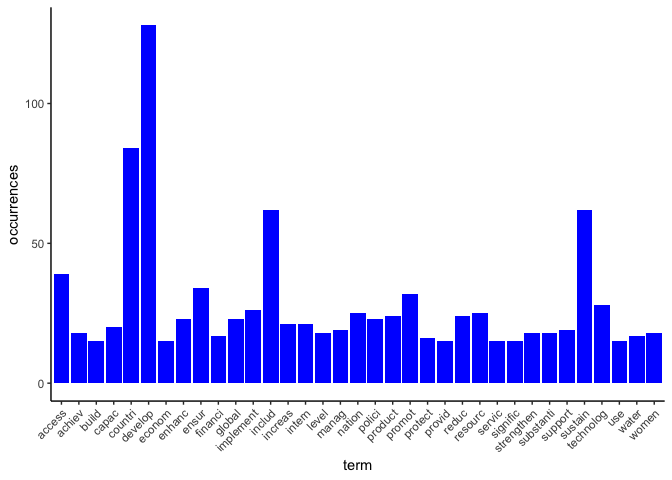

``` r
### clustering the terms
tdm <- TermDocumentMatrix(docs, control = list(wordLengths = c(1, Inf)))
a <- as.matrix(tdm)
b <- sort(rowSums(a),decreasing=TRUE)
c <- data.frame(word = names(b),freq=b)
head(c, 10)
```

    ##                word freq
    ## develop     develop  128
    ## countri     countri   84
    ## includ       includ   62
    ## sustain     sustain   62
    ## access       access   39
    ## ensur         ensur   34
    ## promot       promot   32
    ## technolog technolog   28
    ## implement implement   26
    ## nation       nation   25

``` r
# remove sparse terms
dtmr2 <- removeSparseTerms(tdm, sparse = 0.80)
dtmr2 <- as.matrix(dtmr2)
distMatrix <- dist(scale(dtmr2))
# cluster terms
fit <- hclust(distMatrix, method = "ward.D")
# plot the cluster
plot(fit,cex=0.4)
rect.hclust(fit, k = 6) # cut tree into 6 clusters 
```

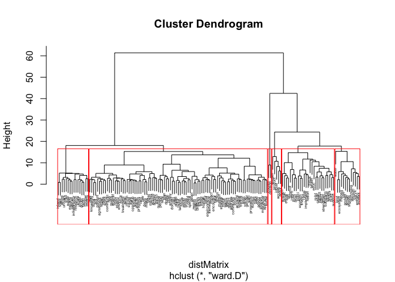

``` r
# wordcloud
library(wordcloud)
```

    ## Loading required package: RColorBrewer

``` r
# setting the same seed each time ensures consistent look across clouds
set.seed(42)
# limit number if terms by specifying min frequence, here frequence >=15 
wordcloud(names(freq),freq, min.freq=15)
```

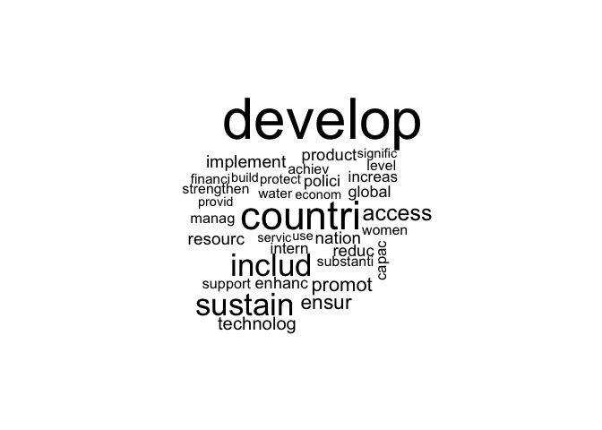

``` r
# add color to the wordclound
wordcloud(names(freq),freq,min.freq=15,colors=brewer.pal(6,"Dark2"))
```

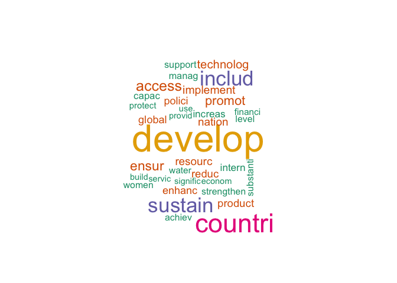

``` r
# other wordcloud representation
library(wordcloud2)
wordcloud2(data=head(wf,100),rotateRatio = 0.4, shape = 'triangle', ellipticity = 0.65)
```

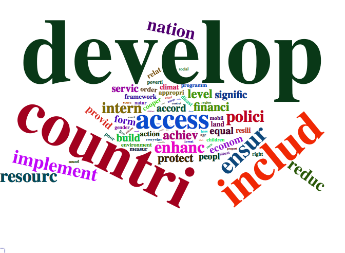

``` r
wordcloud2(data=head(wf,50), shape = 'triangle')
```

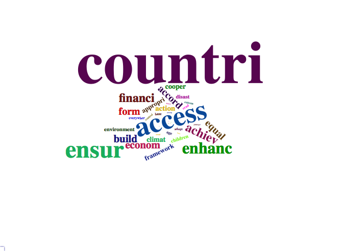

``` r
####  
## Find topics and their terms using the library topicmodels
library(topicmodels)

## reprensation of the topics / terms using "Latent Dirichlet Allocation" algorithm
# find 5 topics (k=5)
ap_lda <- LDA(dtm,method="Gibbs", k = 5)
# find the 5 first terms of every topic
term <- terms(ap_lda, 5) 
term <- apply(term, MARGIN = 2, paste, collapse = ", ")
term
```

    ##                                        Topic 1 
    ##         "sustain, resourc, manag, includ, use" 
    ##                                        Topic 2 
    ##  "ensur, access, strengthen, water, substanti" 
    ##                                        Topic 3 
    ##       "product, intern, includ, nation, level" 
    ##                                        Topic 4 
    ## "develop, countri, technolog, global, support" 
    ##                                        Topic 5 
    ##       "includ, promot, financi, equal, accord"

``` r
##  term - topic probabilities
library(tidytext)
abstract_topics <- tidy(ap_lda, matrix = "beta")
abstract_topics
```

    ## # A tibble: 3,815 x 3
    ##    topic term        beta
    ##    <int> <chr>      <dbl>
    ##  1     1 acceler 0.000163
    ##  2     2 acceler 0.000136
    ##  3     3 acceler 0.00172 
    ##  4     4 acceler 0.000119
    ##  5     5 acceler 0.000162
    ##  6     1 access  0.000163
    ##  7     2 access  0.0355  
    ##  8     3 access  0.000156
    ##  9     4 access  0.0144  
    ## 10     5 access  0.00178 
    ## # ... with 3,805 more rows

``` r
library(ggplot2)
library(dplyr)
```

    ## 
    ## Attaching package: 'dplyr'

    ## The following objects are masked from 'package:stats':
    ## 
    ##     filter, lag

    ## The following objects are masked from 'package:base':
    ## 
    ##     intersect, setdiff, setequal, union

``` r
# term - topic probabilities
ap_top_terms <- abstract_topics %>%
  group_by(topic) %>%
  top_n(10, beta) %>%
  ungroup() %>%
  arrange(topic, -beta)
ap_top_terms %>%
  mutate(term = reorder(term, beta)) %>%
  ggplot(aes(term, beta, fill = factor(topic))) +
  geom_col(show.legend = FALSE) +
  facet_wrap(~ topic, scales = "free") +
  coord_flip()
```

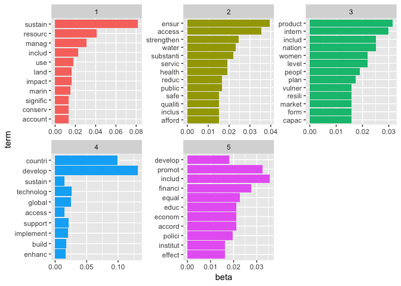

``` r
top_terms <- abstract_topics %>%
  group_by(topic) %>%
  top_n(5, beta) %>%
  ungroup() %>%
  arrange(topic, -beta)
top_terms
```

    ## # A tibble: 28 x 3
    ##    topic term         beta
    ##    <int> <chr>       <dbl>
    ##  1     1 sustain    0.0816
    ##  2     1 resourc    0.0409
    ##  3     1 manag      0.0311
    ##  4     1 includ     0.0230
    ##  5     1 use        0.0181
    ##  6     2 ensur      0.0396
    ##  7     2 access     0.0355
    ##  8     2 strengthen 0.0246
    ##  9     2 water      0.0233
    ## 10     2 substanti  0.0219
    ## # ... with 18 more rows

``` r
## show the terms that are most common within each topic 
top_terms %>%
  mutate(term = reorder(term, beta)) %>%
  ggplot(aes(term, beta, fill = factor(topic))) +
  geom_col(show.legend = FALSE) +
  facet_wrap(~ topic, scales = "free") +
  coord_flip()
```

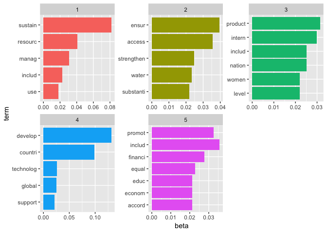

``` r
## another representation of the association terms 
tdm <- TermDocumentMatrix(docs, control = list(wordLengths = c(1, Inf)))
a <- as.matrix(tdm)
b <- sort(rowSums(a),decreasing=TRUE)
c <- data.frame(word = names(b),freq=b)
head(c, 10)
```

    ##                word freq
    ## develop     develop  128
    ## countri     countri   84
    ## includ       includ   62
    ## sustain     sustain   62
    ## access       access   39
    ## ensur         ensur   34
    ## promot       promot   32
    ## technolog technolog   28
    ## implement implement   26
    ## nation       nation   25

``` r
## Freqency terms and Association
idx <- which(dimnames(tdm)$Terms == "ecolog")
inspect(tdm[idx + (0:5), 1:2])
```

    ## <<TermDocumentMatrix (terms: 0, documents: 2)>>
    ## Non-/sparse entries: 0/0
    ## Sparsity           : 100%
    ## Maximal term length: 0
    ## Weighting          : term frequency (tf)
    ## Sample             :
    ##       Docs
    ## Terms  1 2

``` r
# terms association for terms with frequencey >=25
findAssocs(dtm, terms = "biodivers", corlimit = 0.8)
```

    ## $biodivers
    ##   afforest      alien   deforest     demand   desertif    dryland 
    ##       0.98       0.98       0.98       0.98       0.98       0.98 
    ##    extinct      fauna      flora    habitat       halt       hong 
    ##       0.98       0.98       0.98       0.98       0.98       0.98 
    ##     incent     inland  introduct      invas       kong livelihood 
    ##       0.98       0.98       0.98       0.98       0.98       0.98 
    ##  ministeri    neutral      oblig       ongo      poach      pursu 
    ##       0.98       0.98       0.98       0.98       0.98       0.98 
    ##   reforest     revers  terrestri   threaten    wildlif  ecosystem 
    ##       0.98       0.98       0.98       0.98       0.98       0.97 
    ##      speci     forest     degrad     restor       land    benefit 
    ##       0.96       0.96       0.96       0.94       0.90       0.87 
    ##   mountain     urgent    conserv   introduc 
    ##       0.87       0.87       0.82       0.82

``` r
(freq.terms <- findFreqTerms(dtm, lowfreq = 25))
```

    ##  [1] "access"    "countri"   "develop"   "ensur"     "implement"
    ##  [6] "includ"    "nation"    "resourc"   "technolog" "promot"   
    ## [11] "sustain"

``` r
plot(dtm, term = freq.terms, corThreshold = 0.15, weighting = F, 
     attrs=list(node=list(width=20, fontsize=24, fontcolor="blue", color="red")))
```

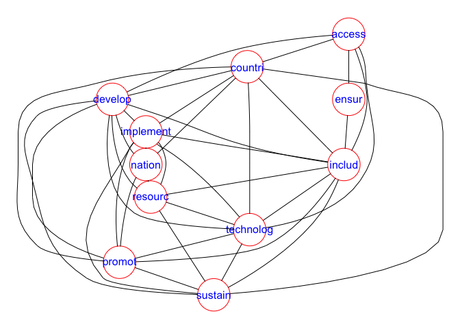

``` r
# can change to terms with frequencey >=2O
(freq.terms <- findFreqTerms(dtm, lowfreq = 20))
```

    ##  [1] "access"    "countri"   "develop"   "enhanc"    "ensur"    
    ##  [6] "implement" "includ"    "intern"    "nation"    "polici"   
    ## [11] "reduc"     "resourc"   "technolog" "capac"     "increas"  
    ## [16] "product"   "promot"    "sustain"   "global"

``` r
plot(dtm, term = freq.terms, corThreshold = 0.15, weighting = F, 
     attrs=list(node=list(width=20, fontsize=24, fontcolor="blue", color="red")))
```

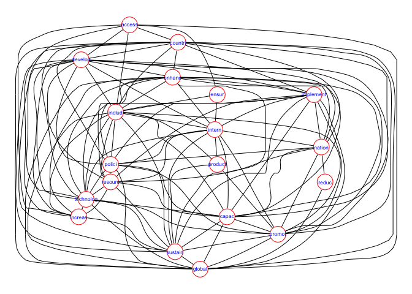

``` r
###### prepare the list of SGDs
listSDGs<-list.files("./Text_SDGs")
listSDGs<-data.frame(listSDGs)
row.names(listSDGs) <- listSDGs$listSDGs
listSDGs
```

    ##                  listSDGs
    ## 01_SDG1.txt   01_SDG1.txt
    ## 02_SDG2.txt   02_SDG2.txt
    ## 03_SDG3.txt   03_SDG3.txt
    ## 04_SDG4.txt   04_SDG4.txt
    ## 05_SDG5.txt   05_SDG5.txt
    ## 06_SDG6.txt   06_SDG6.txt
    ## 07_SDG7.txt   07_SDG7.txt
    ## 08_SDG8.txt   08_SDG8.txt
    ## 09_SDG9.txt   09_SDG9.txt
    ## 10_SDG10.txt 10_SDG10.txt
    ## 11_SDG11.txt 11_SDG11.txt
    ## 12_SDG12.txt 12_SDG12.txt
    ## 13_SDG13.txt 13_SDG13.txt
    ## 14_SDG14.txt 14_SDG14.txt
    ## 15_SDG15.txt 15_SDG15.txt
    ## 16_SDG16.txt 16_SDG16.txt
    ## 17_SDG17.txt 17_SDG17.txt

``` r
## network analysis and network representation
library(ggraph)
library(ggforce)
library(igraph)
```

    ## 
    ## Attaching package: 'igraph'

    ## The following objects are masked from 'package:dplyr':
    ## 
    ##     as_data_frame, groups, union

    ## The following objects are masked from 'package:stats':
    ## 
    ##     decompose, spectrum

    ## The following object is masked from 'package:base':
    ## 
    ##     union

``` r
library(tnet)
```

    ## Loading required package: survival

    ## tnet: Analysis of Weighted, Two-mode, and Longitudinal networks.
    ## Type ?tnet for help.

``` r
reseau<-data.frame(as.matrix(dtm))
onep<-projecting_tm(reseau, method="Newman")
closeness_w(onep, directed=NULL, gconly=TRUE, precomp.dist=NULL, alpha=1)
```

    ##       node  closeness n.closeness
    ##  [1,]    1 0.05436004 0.003397502
    ##  [2,]    2 0.07269176 0.004543235
    ##  [3,]    3 0.06299308 0.003937067
    ##  [4,]    4 0.05659133 0.003536958
    ##  [5,]    5 0.05649748 0.003531092
    ##  [6,]    6 0.05071969 0.003169981
    ##  [7,]    7 0.03125442 0.001953401
    ##  [8,]    8 0.06982915 0.004364322
    ##  [9,]    9 0.06222176 0.003888860
    ## [10,]   10 0.06117112 0.003823195
    ## [11,]   11 0.06723717 0.004202323
    ## [12,]   12 0.06591157 0.004119473
    ## [13,]   13 0.05184251 0.003240157
    ## [14,]   14 0.06193601 0.003871000
    ## [15,]   15 0.06379756 0.003987348
    ## [16,]   16 0.04694623 0.002934140
    ## [17,]   17 0.08129675 0.005081047

``` r
clustering_local_w(onep)
```

    ##       node am
    ##  [1,]    1  1
    ##  [2,]    2  1
    ##  [3,]    3  1
    ##  [4,]    4  1
    ##  [5,]    5  1
    ##  [6,]    6  1
    ##  [7,]    7  1
    ##  [8,]    8  1
    ##  [9,]    9  1
    ## [10,]   10  1
    ## [11,]   11  1
    ## [12,]   12  1
    ## [13,]   13  1
    ## [14,]   14  1
    ## [15,]   15  1
    ## [16,]   16  1
    ## [17,]   17  1

``` r
### transform to igraph object
onep.i<-tnet_igraph(onep, type="weighted one-mode tnet")
summary(onep.i)
```

    ## IGRAPH eaa612a U-W- 17 136 -- 
    ## + attr: weight (e/n)

``` r
# plot
V(onep.i)$name<-rownames(listSDGs)
plot(onep.i, layout=layout.fruchterman.reingold)
```

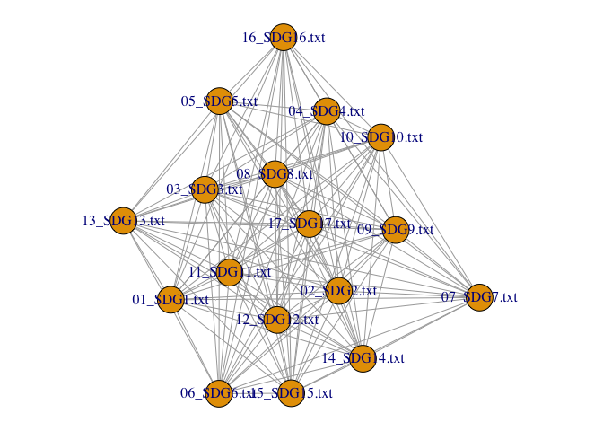

``` r
plot.igraph(onep.i,vertex.label=V(onep.i)$name,
            layout=layout.fruchterman.reingold, edge.color="black",
            vertex.color="orange",edge.width=E(onep.i)$weight/5)
```

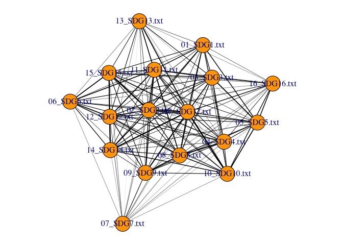

``` r
dg <- decompose.graph(onep.i)
length(dg)
```

    ## [1] 1

``` r
plot(dg[[1]],directed=T)
```

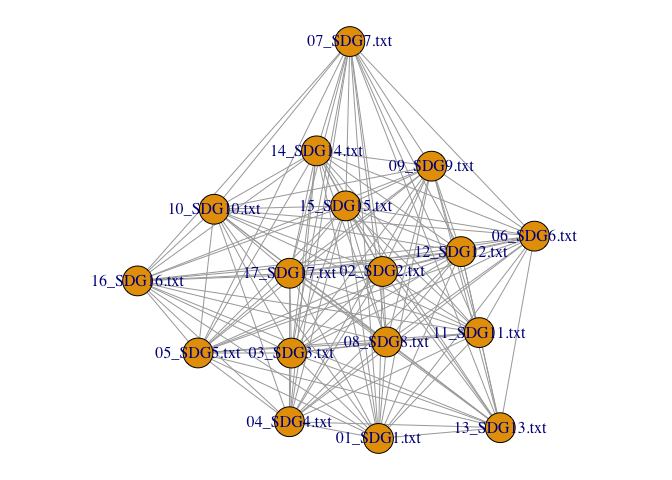

``` r
mc <- maximal.cliques(onep.i)
length(mc)
```

    ## [1] 1

``` r
sapply(mc, length)
```

    ## [1] 17

``` r
### modularity
### Community structure via greedy optimization of modularity
##  http://kateto.net/netscix2016
# see also Community detection
net.sym <- as.undirected(onep.i, mode= "collapse",
                         edge.attr.comb=list(weight="sum", "ignore"))
plot(net.sym)
```

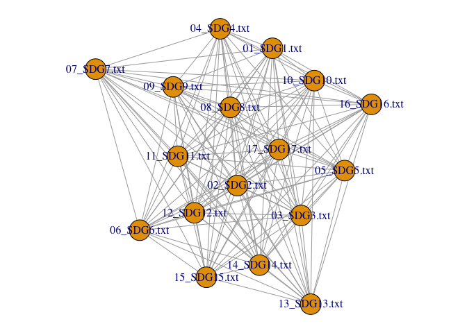

``` r
fastgreedy.community(onep.i)
```

    ## IGRAPH clustering fast greedy, groups: 3, mod: 0.03
    ## + groups:
    ##   $`1`
    ##   [1] "01_SDG1.txt"  "03_SDG3.txt"  "05_SDG5.txt"  "10_SDG10.txt"
    ##   [5] "16_SDG16.txt" "17_SDG17.txt"
    ##   
    ##   $`2`
    ##   [1] "02_SDG2.txt"  "06_SDG6.txt"  "11_SDG11.txt" "12_SDG12.txt"
    ##   [5] "13_SDG13.txt" "14_SDG14.txt" "15_SDG15.txt"
    ##   
    ##   $`3`
    ##   [1] "04_SDG4.txt" "07_SDG7.txt" "08_SDG8.txt" "09_SDG9.txt"
    ##   + ... omitted several groups/vertices

``` r
fc <- cluster_fast_greedy(onep.i)
membership(fc)
```

    ##  01_SDG1.txt  02_SDG2.txt  03_SDG3.txt  04_SDG4.txt  05_SDG5.txt 
    ##            1            2            1            3            1 
    ##  06_SDG6.txt  07_SDG7.txt  08_SDG8.txt  09_SDG9.txt 10_SDG10.txt 
    ##            2            3            3            3            1 
    ## 11_SDG11.txt 12_SDG12.txt 13_SDG13.txt 14_SDG14.txt 15_SDG15.txt 
    ##            2            2            2            2            2 
    ## 16_SDG16.txt 17_SDG17.txt 
    ##            1            1

``` r
sizes(fc)
```

    ## Community sizes
    ## 1 2 3 
    ## 6 7 4

``` r
dendPlot(fc,mode="hclust")
```

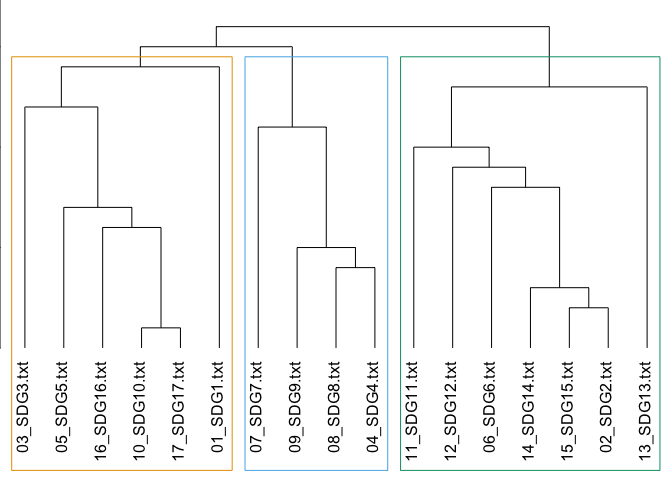

``` r
V(onep.i)$color <- fc$membership+1
g <- set_graph_attr(onep.i, "layout", layout.fruchterman.reingold(onep.i))
plot(g, vertex.label.dist=1.0,
     edge.width=E(onep.i)$weight/5, edge.color="black")
```

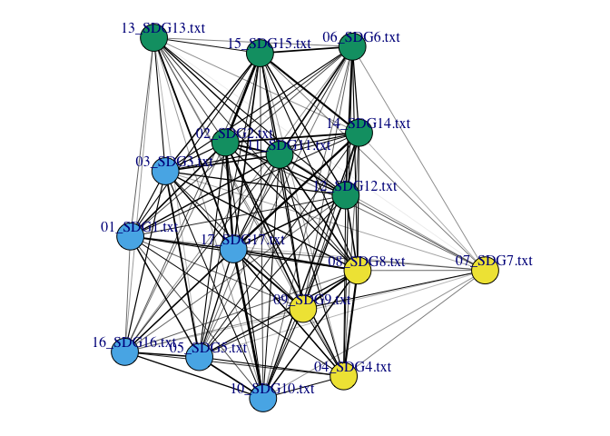

``` r
# Finding community structure by multi-level optimization of modularity
ceb <- cluster_fast_greedy(onep.i)

# plot dendrogram
dendPlot(ceb)
```

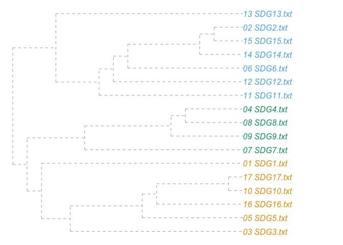

``` r
# plot network with modules
plot(ceb, onep.i,cex=0.1)
```

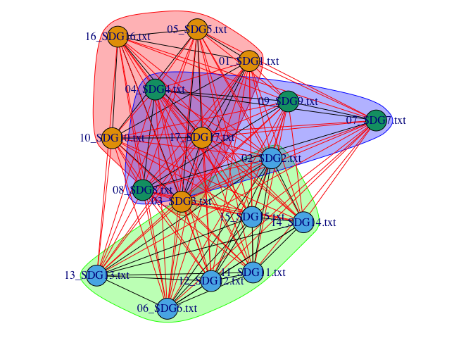

The network analysis of shared terms shows a grouping of SDGs into three groups, also visulizes by a dendrogram. The first group includes the goals of justice and rights such as social justice, economic justice, gender equality, health and peace. It should be noted that SDG 17 dedicated to the achievement of the SDGs is integrated into this group. The second group combines the traditional development goals (i.e. Millenium Devlopment Goals) that focus on education, innovation, infrastructure, energy and the economy. Finally, the third group is the one grouping the objectives associated with the environment: climate, living resources, biodiversity, sustainable agriculture, water, responsible consumption, sustainable cities and the fight against undernutrition.

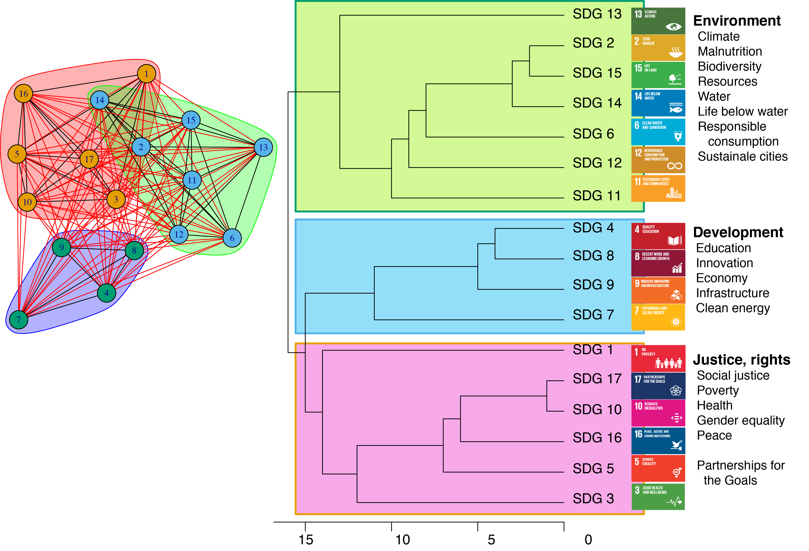
