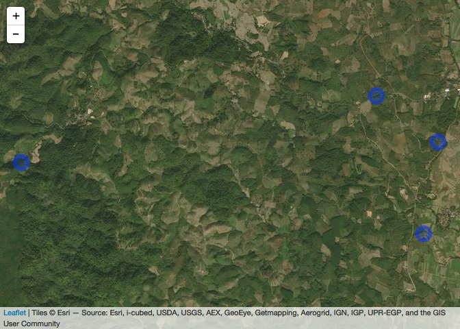

geotaged pictures
================
Serge Morand for FutureHealtSEA
8/13/2018

Extracting exif data from photos using R
----------------------------------------

using smart phones with app gps camera or gps device This script is based on: <http://www.seascapemodels.org/rstats/2016/11/14/extract-exif.html>

``` r
library(exifr)
```

    ## Using ExifTool version 10.61

``` r
library(dplyr)
```

    ## 
    ## Attaching package: 'dplyr'

    ## The following objects are masked from 'package:stats':
    ## 
    ##     filter, lag

    ## The following objects are masked from 'package:base':
    ## 
    ##     intersect, setdiff, setequal, union

``` r
library(leaflet)

# extract all images of the folder
# there are 4 images: one from a wiko cell phone and three from a GPS Garmin 
# extract data, be carefull of the extension of the files: "*.jpg" or "*.jpeg", or "*.JPG"
# (here ".jpg" extension)
files <- list.files(pattern = "*.jpg")
pics <- exifr(files)
```

    ## exifr() is deprecated, and has been replaced by read_exif()

``` r
# investigate pics and the number of variables encrypted in a picture from a smart phone or GPS device
names(pics)
```

    ##   [1] "SourceFile"                "ExifToolVersion"          
    ##   [3] "FileName"                  "Directory"                
    ##   [5] "FileSize"                  "FileModifyDate"           
    ##   [7] "FileAccessDate"            "FileInodeChangeDate"      
    ##   [9] "FilePermissions"           "FileType"                 
    ##  [11] "FileTypeExtension"         "MIMEType"                 
    ##  [13] "JFIFVersion"               "ResolutionUnit"           
    ##  [15] "ExifByteOrder"             "Make"                     
    ##  [17] "Model"                     "Orientation"              
    ##  [19] "XResolution"               "YResolution"              
    ##  [21] "ModifyDate"                "FNumber"                  
    ##  [23] "ExifVersion"               "DateTimeOriginal"         
    ##  [25] "Flash"                     "FocalLength"              
    ##  [27] "FlashpixVersion"           "ColorSpace"               
    ##  [29] "ExifImageWidth"            "ExifImageHeight"          
    ##  [31] "WhiteBalance"              "DigitalZoomRatio"         
    ##  [33] "GPSVersionID"              "GPSLatitudeRef"           
    ##  [35] "GPSLongitudeRef"           "GPSAltitudeRef"           
    ##  [37] "GPSImgDirectionRef"        "GPSImgDirection"          
    ##  [39] "GPSMapDatum"               "XMPToolkit"               
    ##  [41] "CurrentIPTCDigest"         "CodedCharacterSet"        
    ##  [43] "ApplicationRecordVersion"  "TimeCreated"              
    ##  [45] "DateCreated"               "IPTCDigest"               
    ##  [47] "ProfileCMMType"            "ProfileVersion"           
    ##  [49] "ProfileClass"              "ColorSpaceData"           
    ##  [51] "ProfileConnectionSpace"    "ProfileDateTime"          
    ##  [53] "ProfileFileSignature"      "PrimaryPlatform"          
    ##  [55] "CMMFlags"                  "DeviceManufacturer"       
    ##  [57] "DeviceModel"               "DeviceAttributes"         
    ##  [59] "RenderingIntent"           "ConnectionSpaceIlluminant"
    ##  [61] "ProfileCreator"            "ProfileID"                
    ##  [63] "ProfileCopyright"          "ProfileDescription"       
    ##  [65] "MediaWhitePoint"           "MediaBlackPoint"          
    ##  [67] "RedMatrixColumn"           "GreenMatrixColumn"        
    ##  [69] "BlueMatrixColumn"          "DeviceMfgDesc"            
    ##  [71] "DeviceModelDesc"           "ViewingCondDesc"          
    ##  [73] "ViewingCondIlluminant"     "ViewingCondSurround"      
    ##  [75] "ViewingCondIlluminantType" "Luminance"                
    ##  [77] "MeasurementObserver"       "MeasurementBacking"       
    ##  [79] "MeasurementGeometry"       "MeasurementFlare"         
    ##  [81] "MeasurementIlluminant"     "Technology"               
    ##  [83] "RedTRC"                    "GreenTRC"                 
    ##  [85] "BlueTRC"                   "ImageWidth"               
    ##  [87] "ImageHeight"               "EncodingProcess"          
    ##  [89] "BitsPerSample"             "ColorComponents"          
    ##  [91] "YCbCrSubSampling"          "Aperture"                 
    ##  [93] "DateTimeCreated"           "GPSAltitude"              
    ##  [95] "GPSLatitude"               "GPSLongitude"             
    ##  [97] "GPSPosition"               "ImageSize"                
    ##  [99] "Megapixels"                "FocalLength35efl"         
    ## [101] "Software"                  "ExposureTime"             
    ## [103] "ExposureProgram"           "ISO"                      
    ## [105] "CreateDate"                "ComponentsConfiguration"  
    ## [107] "ExposureCompensation"      "MeteringMode"             
    ## [109] "LightSource"               "SubSecTime"               
    ## [111] "SubSecTimeOriginal"        "SubSecTimeDigitized"      
    ## [113] "ExposureMode"              "SceneCaptureType"         
    ## [115] "GPSSpeedRef"               "CreatorTool"              
    ## [117] "Description"               "DigitalCreationTime"      
    ## [119] "DigitalCreationDate"       "DigitalCreationDateTime"  
    ## [121] "ShutterSpeed"              "SubSecCreateDate"         
    ## [123] "SubSecDateTimeOriginal"    "SubSecModifyDate"         
    ## [125] "LightValue"

``` r
# select the useful columns (file name, date of the pictures, longitude, latitude)
pics2 <- select(pics,FileName,
               DateTimeOriginal,
                 GPSLongitude, GPSLatitude)
names(pics2) # see the file
```

    ## [1] "FileName"         "DateTimeOriginal" "GPSLongitude"    
    ## [4] "GPSLatitude"

``` r
# map using leaflet (see training leaflet)
leaflet(pics2) %>%
  addProviderTiles("Esri.WorldImagery") %>%
  addCircleMarkers(~ GPSLongitude, ~ GPSLatitude)
```



``` r
# Add markers showing the pictures on the map
# be aware of the size of the images (reduce the size)
# map using leaflet (see training leaflet)

map<-leaflet(pics2) %>%
  addProviderTiles("Esri.WorldImagery") %>%
  addCircleMarkers(data = pics2, lng =~pics2$GPSLongitude[1], lat = ~pics2$GPSLatitude[1],
                 popup = paste0("<image src=",pics2$FileName[1],">"))%>%
  addCircleMarkers(data = pics2, lng =~pics2$GPSLongitude[2], 
                   lat = ~pics2$GPSLatitude[2],
                 popup = paste0("<image src=",pics2$FileName[2],">"))%>%
  addCircleMarkers(data = pics2, lng =~pics2$GPSLongitude[3], 
                   lat = ~pics2$GPSLatitude[3],
                   popup = paste0("<image src=",pics2$FileName[3],">"))%>%
  addCircleMarkers(data = pics2, lng =~pics2$GPSLongitude[4], 
                   lat = ~pics2$GPSLatitude[4],
                   popup = paste0("<image src=",pics2$FileName[4],">"))
map
```


``` r
## save to a html file, to open with you browser
## save your leaflet map with popup images
library(htmlwidgets)
library(webshot)

saveWidget(map, "mymapwithpics.html", selfcontained = FALSE)
```
