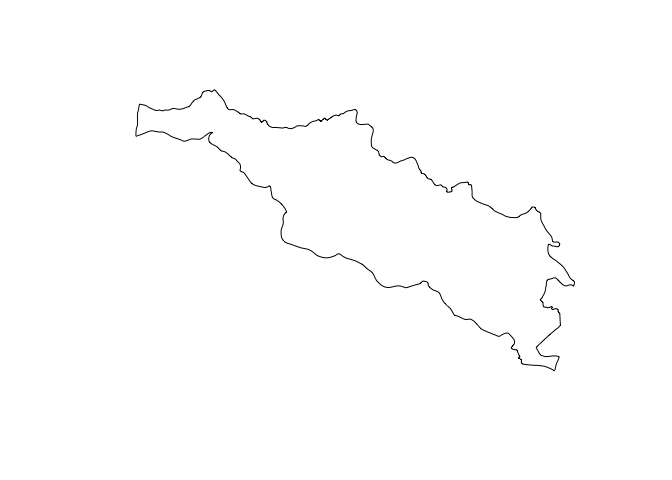

kml R
================
Serge Morand for FutureHealthSEA
8/13/2018

``` r
knitr::opts_chunk$set(echo = TRUE)
```

how to write kml file
---------------------

``` r
# a R script example how to write kml file (kmlR.R)(spatialpoints or shapefile) with some example datasets (locations, rodents, shapefile) 
# (see also CoordinatesDegreeToDecimal.R to transform the degree to decimal with an example file (example.csv) (id, lat, lon in degree))

## Produce kml for Google Earth
## using package plotKML

# read file with coordinates as "lat" and "lon" (csv file with columns separated by ",")
dat<-read.csv("SaenThong_8villages.csv")
names(dat)  # see your variables
```

    ## [1] "lat"  "lon"  "ele"  "name"

``` r
# select the useful columns in your file using the package dplyr
# select("file",var1, var2, ...)
library(dplyr)
```

    ## 
    ## Attaching package: 'dplyr'

    ## The following objects are masked from 'package:stats':
    ## 
    ##     filter, lag

    ## The following objects are masked from 'package:base':
    ## 
    ##     intersect, setdiff, setequal, union

``` r
dat2 <- select(dat,
                 lat, lon,
                 name)


## create a SpatialPointsDataframe object and add the appropriate CRS
# 
require(maptools)
```

    ## Loading required package: maptools

    ## Loading required package: sp

    ## Checking rgeos availability: TRUE

``` r
require(rgdal)
```

    ## Loading required package: rgdal

    ## rgdal: version: 1.2-16, (SVN revision 701)
    ##  Geospatial Data Abstraction Library extensions to R successfully loaded
    ##  Loaded GDAL runtime: GDAL 2.1.2, released 2016/10/24
    ##  Path to GDAL shared files: /Library/Frameworks/R.framework/Versions/3.3/Resources/library/rgdal/gdal
    ##  GDAL binary built with GEOS: FALSE 
    ##  Loaded PROJ.4 runtime: Rel. 4.9.1, 04 March 2015, [PJ_VERSION: 491]
    ##  Path to PROJ.4 shared files: /Library/Frameworks/R.framework/Versions/3.3/Resources/library/rgdal/proj
    ##  Linking to sp version: 1.2-5

``` r
coordinates(dat2)<- c("lon", "lat")

# now, use the appropriate CRS, here espg:4326
BNG<- CRS("+init=epsg:4326")

proj4string(dat2)<-BNG

## In order for the points to be displayed in the correct place 
# the points need to be re-projected to WGS84 geographical coordinates
p4s <- CRS("+proj=longlat +ellps=WGS84 +datum=WGS84")

dat2_wgs84<- spTransform(dat2, CRS= p4s)

## Using the OGR KML driver we can then export the data to KML. 
# dsn should equal the name of the exported file and the dataset_options argument allows us to specify the labels displayed by each of the points.
writeOGR(dat2_wgs84, dsn="villages.kml", layer= "dat2_wgs84", driver="KML", 
         dataset_options=c("NameField=name"))


library(plotKML)
```

    ## plotKML version 0.5-8 (2017-05-12)

    ## URL: http://plotkml.r-forge.r-project.org/

``` r
# choose the design of the points
# see at http://maps.google.com/mapfiles/kml/
# shape = "http://maps.google.com/mapfiles/kml/shapes/homegardenbusiness.png"
# shape = "http://maps.google.com/mapfiles/kml/pal2/icon18.png"
# as an example, choose pushpin with color
shape ="http://maps.google.com/mapfiles/kml/pushpin/blue-pushpin.png"

# start to create, shape is shape, size is the size of the pushpin on the map
# if add labels, it gives the name of the point (here locality)
kml_open("villages_SaenThong.kml")
```

    ## KML file opened for writing...

``` r
kml_layer(dat2["name"],  z.lim=c(50,80),colour=name,
          colour_scale=SAGA_pal[[1]], shape=shape, size = 1,
          labels = name)
```

    ## Writing to KML...

``` r
kml_close("villages_SaenThong.kml") # finish your kml file
```

    ## Closing  villages_SaenThong.kml

``` r
## ## ## ## 
## an other example with rodents trapped in the province from 2008 to 2017
rat<-read.csv("rodents.thawangpha.csv")
rat2 <- select(rat,
               longitude, latitude,taxonomyID,
               trappingDate)

## filter for the district
rat2<-rat2 %>% 
  filter( 
    latitude>18.9 & longitude<100.8)

# or the sampling of 2018
rat<-read.csv("rodents.saenthong.2018.csv")
names(rat)
```

    ## [1] "id_indiv"     "taxonomyID"   "trappingDate" "latitude"    
    ## [5] "longitude"

``` r
rat2 <- select(rat,
               longitude, latitude,taxonomyID,
               trappingDate)

## create a SpatialPointsDataframe object 
require(maptools)
require(rgdal)
coordinates(rat2)<- c("longitude", "latitude")

# and add the appropriate CRS
BNG<- CRS("+init=epsg:4326")
proj4string(rat2)<-BNG

## In order for the points to be displayed in the correct place they need to be re-projected to WGS84 geographical coordinates.
p4s <- CRS("+proj=longlat +ellps=WGS84 +datum=WGS84")
rat2_wgs84<- spTransform(rat2, CRS= p4s)

## Using the OGR KML driver we can then export the data to KML. dsn should equal the name of the exported file and the dataset_options argument allows us to specify the labels displayed by each of the points.
writeOGR(rat2_wgs84, dsn="RodentTWP1.kml", layer= "dat2_wgs84", driver="KML")

## if you have Google Earth installed double click on the kml file you just created to open it. The points should be loaded as labelled pins on the map.If you click on the pin you will be able to see its full name and capacity. 


library(plotKML)
# you can use your own drawing image as a shape
shape="rodent.png"

# add colour according to rodent taxonomy, by adding "colour=taxonomyID"
kml_open("RodentTWP.kml")
```

    ## KML file opened for writing...

``` r
kml_layer(rat2["taxonomyID"],  z.lim=c(50,80),colour="white",
          colour_scale=SAGA_pal[[1]], shape=shape, size=1,
          points_names="",
          labels = taxonomyID)
```

    ## Writing to KML...

``` r
kml_close("RodentTWP.kml")
```

    ## Closing  RodentTWP.kml

``` r
kml(rat2, shape = shape,  size=1,colour="white", extrude = TRUE, 
    labels =  taxonomyID, kmz = FALSE)
```

    ## KML file opened for writing...

    ## Writing to KML...

    ## Closing  rat2.kml

``` r
## a shape file in kml
#### shapefile of the tamboon Saenthong
library(dismo)
```

    ## Loading required package: raster

    ## 
    ## Attaching package: 'raster'

    ## The following object is masked from 'package:dplyr':
    ## 
    ##     select

``` r
## you need to gave a shape file, read the shape file
saenthong <- shapefile("SaenThong-rgdal.shp")
plot(saenthong) # see the shapefile
```



``` r
library(sp)
##
# area in black
kml(saenthong, file = "SaenThong.kml",colour_scale=rgb(0,0,0, alpha=0.0))
```

    ## KML file opened for writing...

    ## Writing to KML...

    ## Closing  SaenThong.kml

``` r
# transparent, boundary in white
kml(saenthong, file = "SaenThong.kml",alpha = 0.0)
```

    ## KML file opened for writing...

    ## Writing to KML...

    ## Closing  SaenThong.kml
