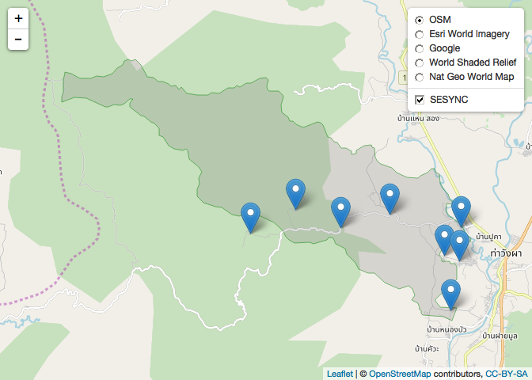
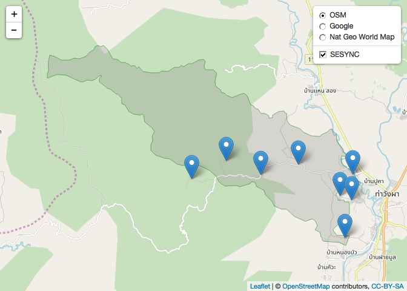

leaflet first
================
Serge Morand
8/13/2018

``` r
knitr::opts_chunk$set(echo = TRUE)
```

A first map in leaflet
----------------------

A simple example how to use leaflet

You can find nice nice introduction / tutorial at: <https://leafletjs.com/index.html> <https://rstudio.github.io/leaflet/> <https://allthisblog.wordpress.com/2016/10/12/r-311-with-leaflet-tutorial/> among many others

for our example here, you need to get the csv file "SaenThong\_8villages.csv" and the shapefile "SaenThong-rgdal" from the folder training kml file

you can also save your map as a html file, that can be opened with you browser

``` r
ban<-read.csv("SaenThong_8villages.csv")
names(ban)
```

    ## [1] "lat"  "lon"  "ele"  "name"

``` r
library(raster)
```

    ## Loading required package: sp

``` r
st<-shapefile("SaenThong-rgdal")

library(leaflet)

leaflet(ban) %>%
  addTiles(group = "OSM") %>%
  addProviderTiles("Esri.WorldImagery",group ="Esri World Imagery") %>%
  addTiles(urlTemplate = "https://mts1.google.com/vt/lyrs=s&hl=en&src=app&x={x}&y={y}&z={z}&s=G",
           attribution = 'Google',group ="Google") %>%
  addProviderTiles("Esri.WorldShadedRelief",group ="World Shaded Relief") %>%
  addProviderTiles("Esri.NatGeoWorldMap",group ="Nat Geo World Map") %>%
  addMarkers(~ lon, ~ lat,  popup = ~as.character(name)) %>%
  addPolygons(data = st,
              color = "green", 
              fillColor = "gray", 
              fillOpacity = 0.25, 
              weight = 1) %>%
  addLayersControl(baseGroups = c("OSM", "Esri World Imagery","Google","World Shaded Relief",
                                  "Nat Geo World Map"), 
                   overlayGroups = c("SESYNC"),
                   options = layersControlOptions(collapsed = FALSE))
```



``` r
library(mapview)
## 'leaflet' objects (image above)
map_ban <- leaflet(ban) %>%
  addTiles(group = "OSM") %>%
  addTiles(urlTemplate = "https://mts1.google.com/vt/lyrs=s&hl=en&src=app&x={x}&y={y}&z={z}&s=G",
           attribution = 'Google',group ="Google") %>%
  addProviderTiles("Esri.NatGeoWorldMap",group ="Nat Geo World Map") %>%
  addMarkers(~ lon, ~ lat,  popup = ~as.character(name)) %>%
  addPolygons(data = st,
              color = "green", 
              fillColor = "gray", 
              fillOpacity = 0.25, 
              weight = 1) %>%
  addLayersControl(baseGroups = c("OSM","Google",
                                  "Nat Geo World Map"), 
                   overlayGroups = c("SESYNC"),
                   options = layersControlOptions(collapsed = FALSE))

map_ban
```



``` r
library(htmlwidgets)
library(webshot)

## save to a html file to be open with you browser
saveWidget(map_ban, "Saenthong.html", selfcontained = FALSE)
```
