Training creating map with elevation, land use and buffers
================
Serge Morand for FutureHealthSEA
8/13/2018

``` r
knitr::opts_chunk$set(echo = TRUE)
```

Creating a map (Nan province / Thawangpha district)
---------------------------------------------------

This is R script for creating a map with elevation, land use, and to get buffers and extract values from land use data Several resources are given: land use, elevation data, administrative boundaries of Thailand

``` r
# you need several libraries
library(raster)
```

    ## Loading required package: sp

``` r
library(rgdal)
```

    ## rgdal: version: 1.2-16, (SVN revision 701)
    ##  Geospatial Data Abstraction Library extensions to R successfully loaded
    ##  Loaded GDAL runtime: GDAL 2.1.2, released 2016/10/24
    ##  Path to GDAL shared files: /Library/Frameworks/R.framework/Versions/3.3/Resources/library/rgdal/gdal
    ##  GDAL binary built with GEOS: FALSE 
    ##  Loaded PROJ.4 runtime: Rel. 4.9.1, 04 March 2015, [PJ_VERSION: 491]
    ##  Path to PROJ.4 shared files: /Library/Frameworks/R.framework/Versions/3.3/Resources/library/rgdal/proj
    ##  Linking to sp version: 1.2-5

``` r
library(dismo)
library(ggplot2)
library(shapefiles)
```

    ## Loading required package: foreign

    ## 
    ## Attaching package: 'shapefiles'

    ## The following objects are masked from 'package:foreign':
    ## 
    ##     read.dbf, write.dbf

``` r
library(rgeos)
```

    ## rgeos version: 0.3-26, (SVN revision 560)
    ##  GEOS runtime version: 3.4.2-CAPI-1.8.2 r3921 
    ##  Linking to sp version: 1.2-5 
    ##  Polygon checking: TRUE

``` r
library(rasterVis)
```

    ## Loading required package: lattice

    ## Loading required package: latticeExtra

    ## Loading required package: RColorBrewer

    ## 
    ## Attaching package: 'latticeExtra'

    ## The following object is masked from 'package:ggplot2':
    ## 
    ##     layer

``` r
#### Adminstrative boundaries
### reading LDD GIS (Nan province) (added in folder LDD)
nan <- shapefile("./LDD/nan-rgdal.shp")
# extracting shapefile of Tha Wangpha
thawangpha<-subset(nan,AMPHOE_E=="Amphoe Tha Wangpha")
thawangpha$TAMBON_IDN # only IDN are given for subdistrict
```

    ##  [1] "550610" "550603" "550608" "550602" "550609" "550601" "550607"
    ##  [8] "550604" "550606" "550605"

``` r
# selecting shapefile of Saen Thong subdisctrict (national ID="550608")
thawangpha_st<-subset(thawangpha,TAMBON_IDN=="550608")
# plot
plot(thawangpha_st)
```

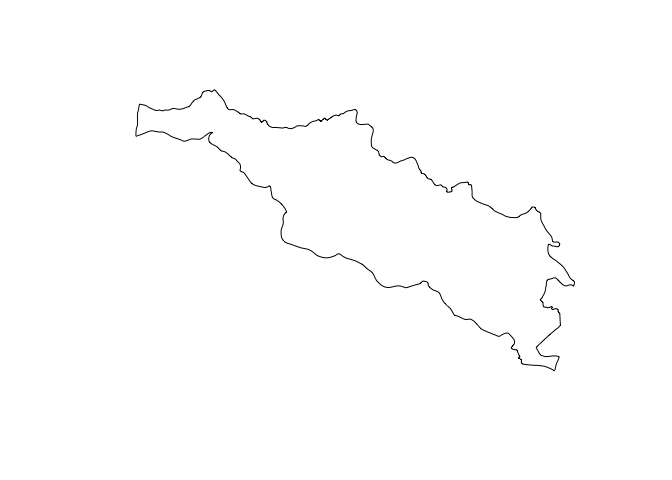

``` r
### reading Gisda GIS for Thailand
# as the files are quite heavy, you have to download by your self at:
# http://www.diva-gis.org/gdata
# selecting "Thailand" and subject = "Administrative Areas"
# as an example, I have only added the shapefile of provinces of Thailand in the folder "Thailand_adm"
thailand <- shapefile("./Thailand_adm/THA_adm1.shp")
# list of provinces of Thailand (LDD GIS)
thailand$NAME_1 
```

    ##  [1] "Amnat Charoen"            "Ang Thong"               
    ##  [3] "Bangkok Metropolis"       "Bueng Kan"               
    ##  [5] "Buri Ram"                 "Chachoengsao"            
    ##  [7] "Chai Nat"                 "Chaiyaphum"              
    ##  [9] "Chanthaburi"              "Chiang Mai"              
    ## [11] "Chiang Rai"               "Chon Buri"               
    ## [13] "Chumphon"                 "Kalasin"                 
    ## [15] "Kamphaeng Phet"           "Kanchanaburi"            
    ## [17] "Khon Kaen"                "Krabi"                   
    ## [19] "Lampang"                  "Lamphun"                 
    ## [21] "Loei"                     "Lop Buri"                
    ## [23] "Mae Hong Son"             "Maha Sarakham"           
    ## [25] "Mukdahan"                 "Nakhon Nayok"            
    ## [27] "Nakhon Pathom"            "Nakhon Phanom"           
    ## [29] "Nakhon Ratchasima"        "Nakhon Sawan"            
    ## [31] "Nakhon Si Thammarat"      "Nan"                     
    ## [33] "Narathiwat"               "Nong Bua Lam Phu"        
    ## [35] "Nong Khai"                "Nonthaburi"              
    ## [37] "Pathum Thani"             "Pattani"                 
    ## [39] "Phangnga"                 "Phatthalung"             
    ## [41] "Phayao"                   "Phetchabun"              
    ## [43] "Phetchaburi"              "Phichit"                 
    ## [45] "Phitsanulok"              "Phra Nakhon Si Ayutthaya"
    ## [47] "Phrae"                    "Phuket"                  
    ## [49] "Prachin Buri"             "Prachuap Khiri Khan"     
    ## [51] "Ranong"                   "Ratchaburi"              
    ## [53] "Rayong"                   "Roi Et"                  
    ## [55] "Sa Kaeo"                  "Sakon Nakhon"            
    ## [57] "Samut Prakan"             "Samut Sakhon"            
    ## [59] "Samut Songkhram"          "Saraburi"                
    ## [61] "Satun"                    "Si Sa Ket"               
    ## [63] "Sing Buri"                "Songkhla"                
    ## [65] "Sukhothai"                "Suphan Buri"             
    ## [67] "Surat Thani"              "Surin"                   
    ## [69] "Tak"                      "Trang"                   
    ## [71] "Trat"                     "Ubon Ratchathani"        
    ## [73] "Udon Thani"               "Uthai Thani"             
    ## [75] "Uttaradit"                "Yala"                    
    ## [77] "Yasothon"

``` r
# getting the shapefile of the province of Nan
thai_nan <- thailand[thailand[["NAME_1"]] == "Nan", ]

# UTILITY: if a shapefile is too heavy and then long to manipulate and plot
# the function gSimplify is a way to simplify its contour while preserving the topology
thailand_s <- gSimplify(thailand, tol=0.01, topologyPreserve=TRUE)
plot(thailand_s)
```

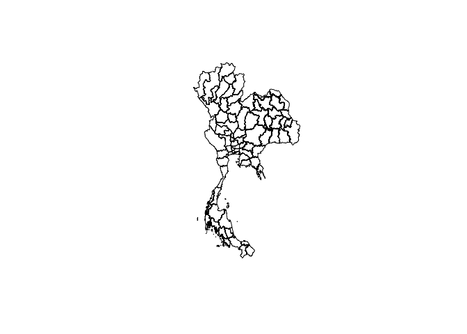

``` r
# shapefile of a subdistrict 
# you have to download from # http://www.diva-gis.org/gdata
thailand3 <- shapefile("./Thailand_adm/THA_adm3.shp")
# list of subdistrict (NOT RUN) (around 6 thousands):
# thailand3$NAME_3 
# shape file of Saen Thong subdistrict
thai_nan_st<-subset(thailand3,NAME_3=="Saen Thong")
plot(thai_nan_st)
```

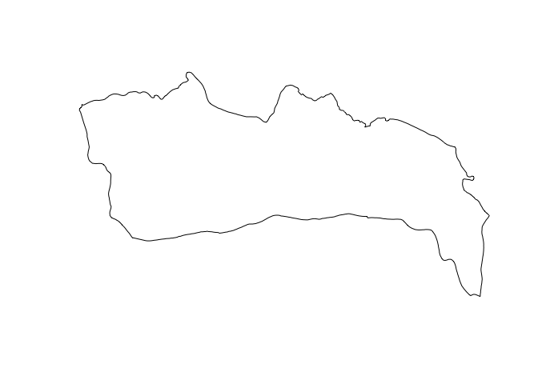

``` r
## now, you can compare the two shapefiles of Saen Thong (LDD and GIS DIVA)
plot(thawangpha_st) # shapefile from LDD
plot(thai_nan_st, add=TRUE) # adding shapefile of GIS DIVA: they don't match!
```

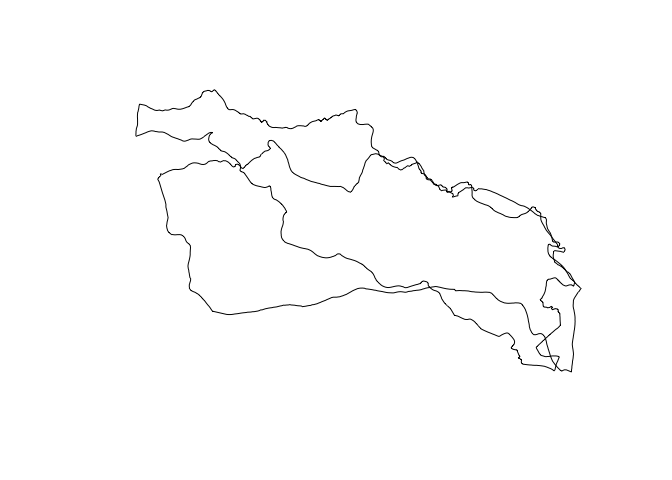

``` r
#### 
#### adding villages of Saen Tong
# the file "SaenThong_8villages.csv" is also in the folder kml
village_all<-read.csv("./SaenThong_8villages.csv")
village_st<-village_all
coordinates(village_st)<- c("lon", "lat")

## we can look which shapefile of Saen Thong includes all villages
plot(thawangpha_st)
plot(thai_nan_st,add=TRUE)
plot(village_st, add=TRUE) # villages of Saen Thong are included in the GIS DIVA
```

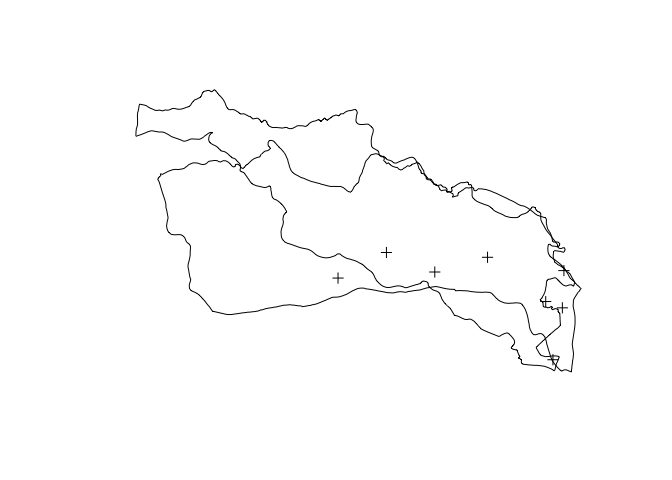

``` r
#### 
#### adding elevation data
# part of this script is from:
# https://www.r-bloggers.com/how-to-quickly-enrich-a-map-with-natural-and-anthropic-details/

### elevation using data from Shuttle Radar Topography Mission (SRTM)
# https://en.wikipedia.org/wiki/Shuttle_Radar_Topography_Mission
# use coordinate point for getting the raster around the point
# use:
# dem.raster <- getData("./STRM_Nan/SRTM", lat = 19.132, lon = 100.791, download = TRUE)
# I have already downloaded and cropped to the size of Nan province using:
# dem.raster_nan <- crop(dem.raster,nan)
# and saving using:
# writeRaster(dem.raster_nan, filename="./STRM/STRM_nan.grd",datatype='INT4S', overwrite=TRUE)
# get the prepared raster

## for Nan province 
dem.raster_nan <- raster("./STRM/STRM_nan")
plot(dem.raster_nan)
```

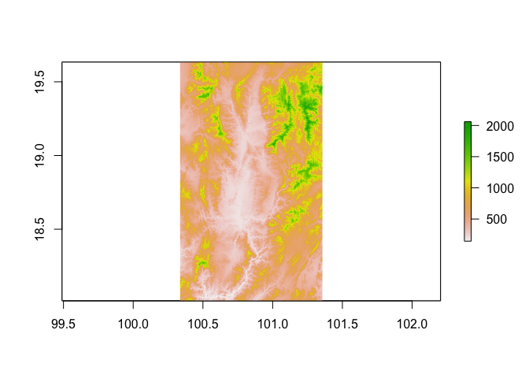

``` r
# crop for Thawangpha
dem.raster_thawangpha <- crop(dem.raster_nan,thawangpha)
plot(dem.raster_thawangpha)
```

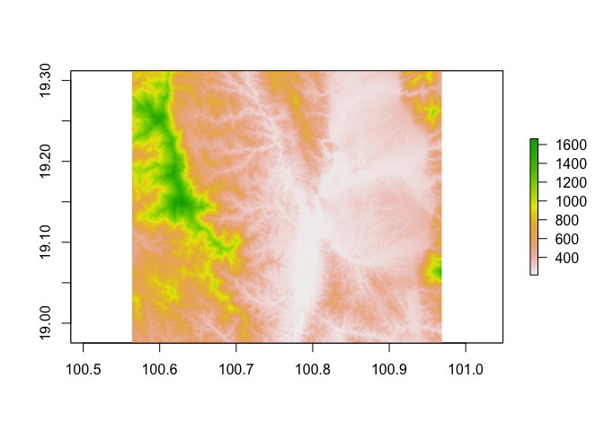

``` r
# The third column of the dem.df contains the altitude value (alt).
dem.m  <-  rasterToPoints(dem.raster_nan)
dem.df <-  data.frame(dem.m)
colnames(dem.df) = c("lon", "lat", "alt")

# Transforming in hill shade 
# Extract slope and aspect of the terrain with raster::terrain(). 
# Compute the hill shade with raster::hillShade(), 
# setting the elevation angle (of the sun) to 40 and the direction angle of the light to 270 
# transform the resulting hill.raster into a data.frame
slope.raster <- terrain(dem.raster_nan, opt='slope')
aspect.raster <- terrain(dem.raster_nan, opt='aspect')
hill.raster <- hillShade(slope.raster, aspect.raster, 40, 270)

hill.m <- rasterToPoints(hill.raster)
hill.df <-  data.frame(hill.m)
colnames(hill.df) <- c("lon", "lat", "hill")

# look the results for Nan
plot(hill.raster,col=gray.colors(10)) # to get range of grey colors
plot(thai_nan_st,add=TRUE)
plot(thai_nan,add=TRUE)
plot(village_st
     ,add=TRUE)
```

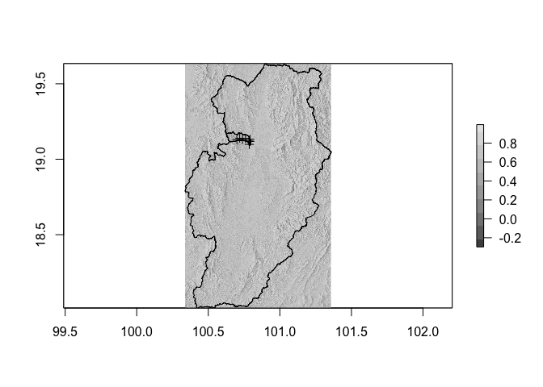

``` r
## now, for Thanwgpha district
dem.m_thawangpha  <-  rasterToPoints(dem.raster_thawangpha)
dem.df_thawangpha  <-  data.frame(dem.m_thawangpha )
colnames(dem.df_thawangpha ) = c("lon", "lat", "alt")

slope.raster_thawangpha  <- terrain(dem.raster_thawangpha , opt='slope')
aspect.raster_thawangpha  <- terrain(dem.raster_thawangpha, opt='aspect')
hill.raster_thawangpha  <- hillShade(slope.raster_thawangpha, aspect.raster_thawangpha,
                                     40, 270)

hill.m_thawangpha  <- rasterToPoints(hill.raster_thawangpha)
hill.df_thawangpha  <-  data.frame(hill.m_thawangpha)
colnames(hill.df_thawangpha) <- c("lon", "lat", "hill")

# look the results for Thawangpha
plot(hill.raster_thawangpha,col=gray.colors(10)) # to get range of grey colors
plot(thai_nan_st,add=TRUE)
plot(thai_nan,add=TRUE)
plot(village_st
     ,add=TRUE)
```

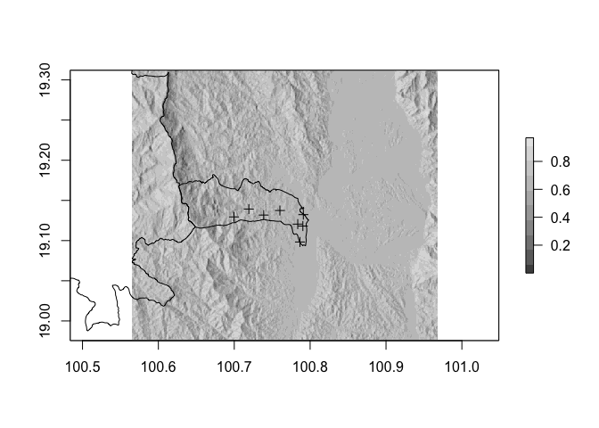

``` r
### another elevation data
## which allows to add elevation lines to a map
## see http://topotools.cr.usgs.gov/GMTED_viewer/viewer.htm
## Explanation of the 0.5 arc-sec shift (pp. 9--10):
## http://pubs.usgs.gov/of/2011/1073/pdf/of2011-1073.pdf
## file downloaded on 2015-08-25 from:
## http://topotools.cr.usgs.gov/gmted_viewer/gmted2010_global_grids.php
# the DEM of Indochina has been already prepared and added in the folder "dem"
demindochina<-raster("./dem/dem_indochina")
dem_nan<- crop(demindochina, extent(100.3415 , 101.3582, 18.00819 , 19.63319 ))
dem_nan_t <- mask(dem_nan,nan)
dem_nan_line_t <- rasterToContour(dem_nan_t, nlevels = 50)

# getting elevation for each village
my.pts.elevation <- extract(dem_nan,village_st)
my.pts.elevation
```

    ## [1] 231 231 231 272 324 339 403 224

``` r
# getting elevation by village
village_7<-subset(village_st,name=="7 Ban Santisouk")
plot(thai_nan_st)
plot(village_7, add=TRUE)
```


``` r
my.pt.elevation <- extract(dem_nan,village_7)
my.pt.elevation
```

    ##     
    ## 403

``` r
village_1<-subset(village_st,name=="1 Ban Na Non")
plot(thai_nan_st)
plot(village_1, add=TRUE)
```

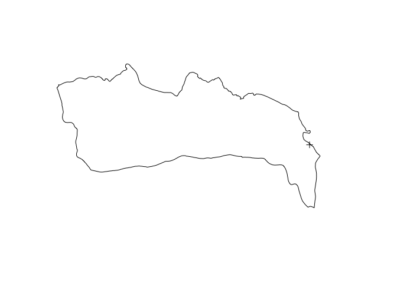

``` r
my.pt.elevation <- extract(dem_nan,village_1)
my.pt.elevation
```

    ##     
    ## 231

``` r
## draw a line between 2 villages
library(dplyr) # prepare from two villages
```

    ## 
    ## Attaching package: 'dplyr'

    ## The following objects are masked from 'package:rgeos':
    ## 
    ##     intersect, setdiff, union

    ## The following objects are masked from 'package:raster':
    ## 
    ##     intersect, select, union

    ## The following objects are masked from 'package:stats':
    ## 
    ##     filter, lag

    ## The following objects are masked from 'package:base':
    ## 
    ##     intersect, setdiff, setequal, union

``` r
my_points<-select(village_all, "lon","lat")
ban7<-filter(my_points, row_number() == 7L)
ban1<-filter(my_points, row_number() == 1L)
ban1_7<-full_join(ban1,ban7)
```

    ## Joining, by = c("lon", "lat")

``` r
library(sf) # this library helps at getting a spatial line between two spatial points
```

    ## Linking to GEOS 3.4.2, GDAL 2.1.2, proj.4 4.9.1

``` r
# you need to add a reference system
my_points.sf.7_1 <- st_as_sf(ban1_7, coords = c("lon", "lat"), crs = 4326)
my_line.sf.7_1<-SpatialLines(list(Lines(Line(ban1_7), ID="a")))
my_line.sf.7_1@proj4string<-CRS("+proj=longlat +ellps=WGS84 +datum=WGS84 +no_defs")

plot(thai_nan_st)
plot(my_points.sf.7_1,add=TRUE)
plot(my_line.sf.7_1,add=TRUE)
```

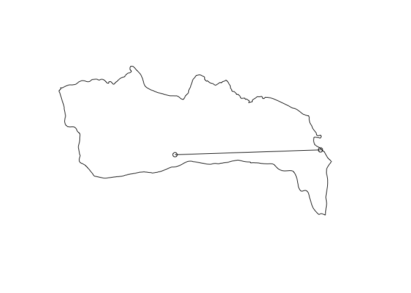

``` r
# extract elevation along the line
my.pt.elevation <- extract(dem_nan,my_line.sf.7_1)
my.pt.elevation # elevation data in meter along the line
```

    ## [[1]]
    ##  [1] 403 368 412 388 360 324 312 292 275 265 261 231

``` r
####
### land use
## land use from UCLouvain ESA Globcover dataset, to get the world data
## Download at: http://due.esrin.esa.int/page_globcover.php 
# here, I prepared the land use of nan
# landuse <- raster("./ressources/Globcover2009_V2.3_Global/GLOBCOVER_L4_200901_200912_V2.3.tif")
# landuse_nan <- crop(landuse, extent(100.3415 , 101.3582, 18.00819 , 19.63319 ))
# writeRaster(landuse_nan, filename="landuse_nan", bandorder='BIL', overwrite=TRUE)

landuse <- raster("./landuse/landuse_nan")

# landuse of Nan
landuse_nan<-mask(landuse,nan)
plot(landuse_nan)
```

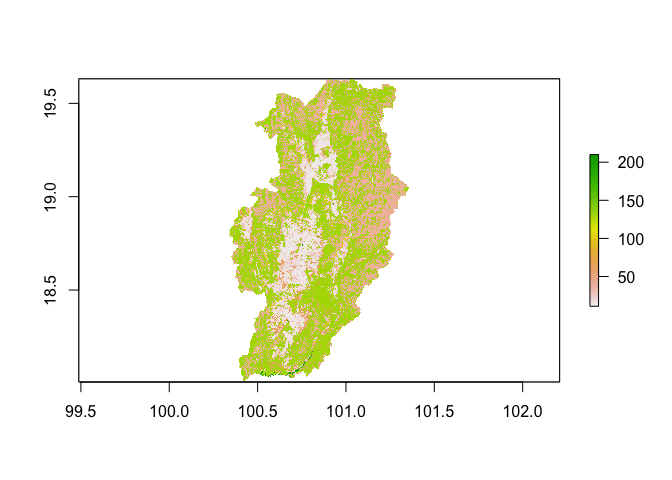

``` r
cellStats(landuse_nan,'mean') # cellStats to compute some stats from the raster
```

    ## [1] 82.82223

``` r
# landuse of Thawangpha
landuse_nan_twp<- crop(landuse, extent(100.56 , 100.97, 18.975 , 19.313 ))
landuse_nan_twp_m<-mask(landuse_nan_twp,thawangpha)

# getting information on land use, patches, superficy, etc 
# using "fragstats" implemented in the package SDMTools
library(SDMTools)
```

    ## 
    ## Attaching package: 'SDMTools'

    ## The following object is masked from 'package:raster':
    ## 
    ##     distance

``` r
ps.data = PatchStat(landuse_nan)
ps.data
```

    ##    patchID n.cell n.core.cell n.edges.perimeter n.edges.internal  area
    ## 1       11    150           1               372              228   150
    ## 2       14  11727        3336             12160            34748 11727
    ## 3       20   9892         455             19360            20208  9892
    ## 4       30   3916          14             10658             5006  3916
    ## 5       40  34021        6029             46180            89904 34021
    ## 6       50    668           0              2194              478   668
    ## 7       60   4708         140              9632             9200  4708
    ## 8       70    686           4              1748              996   686
    ## 9      100   1737           3              4722             2226  1737
    ## 10     110      6           0                22                2     6
    ## 11     120      3           0                 8                4     3
    ## 12     130  67292       18757             65440           203728 67292
    ## 13     140     31           0               112               12    31
    ## 14     210    272           0               580              508   272
    ##    core.area perimeter perim.area.ratio shape.index frac.dim.index
    ## 1          1       372        2.4800000    7.440000       1.809192
    ## 2       3336     12160        1.0369233   28.018433       1.711828
    ## 3        455     19360        1.9571371   48.643216       1.844597
    ## 4         14     10658        2.7216547   42.293651       1.906911
    ## 5       6029     46180        1.3573969   62.574526       1.792860
    ## 6          0      2194        3.2844311   21.096154       1.939394
    ## 7        140      9632        2.0458794   34.898551       1.841441
    ## 8          4      1748        2.5481050   16.490566       1.861904
    ## 9          3      4722        2.7184801   28.107143       1.896454
    ## 10         0        22        3.6666667    2.200000       1.902876
    ## 11         0         8        2.6666667    1.000000       1.261860
    ## 12     18757     65440        0.9724782   63.044316       1.745574
    ## 13         0       112        3.6129032    4.666667       1.940720
    ## 14         0       580        2.1323529    8.787879       1.775565
    ##    core.area.index
    ## 1      0.006666667
    ## 2      0.284471732
    ## 3      0.045996765
    ## 4      0.003575077
    ## 5      0.177214074
    ## 6      0.000000000
    ## 7      0.029736619
    ## 8      0.005830904
    ## 9      0.001727116
    ## 10     0.000000000
    ## 11     0.000000000
    ## 12     0.278740415
    ## 13     0.000000000
    ## 14     0.000000000

``` r
PatchStat(landuse_nan) # metadata for patchID is given in "Globcover2009_Legend.xls"
```

    ##    patchID n.cell n.core.cell n.edges.perimeter n.edges.internal  area
    ## 1       11    150           1               372              228   150
    ## 2       14  11727        3336             12160            34748 11727
    ## 3       20   9892         455             19360            20208  9892
    ## 4       30   3916          14             10658             5006  3916
    ## 5       40  34021        6029             46180            89904 34021
    ## 6       50    668           0              2194              478   668
    ## 7       60   4708         140              9632             9200  4708
    ## 8       70    686           4              1748              996   686
    ## 9      100   1737           3              4722             2226  1737
    ## 10     110      6           0                22                2     6
    ## 11     120      3           0                 8                4     3
    ## 12     130  67292       18757             65440           203728 67292
    ## 13     140     31           0               112               12    31
    ## 14     210    272           0               580              508   272
    ##    core.area perimeter perim.area.ratio shape.index frac.dim.index
    ## 1          1       372        2.4800000    7.440000       1.809192
    ## 2       3336     12160        1.0369233   28.018433       1.711828
    ## 3        455     19360        1.9571371   48.643216       1.844597
    ## 4         14     10658        2.7216547   42.293651       1.906911
    ## 5       6029     46180        1.3573969   62.574526       1.792860
    ## 6          0      2194        3.2844311   21.096154       1.939394
    ## 7        140      9632        2.0458794   34.898551       1.841441
    ## 8          4      1748        2.5481050   16.490566       1.861904
    ## 9          3      4722        2.7184801   28.107143       1.896454
    ## 10         0        22        3.6666667    2.200000       1.902876
    ## 11         0         8        2.6666667    1.000000       1.261860
    ## 12     18757     65440        0.9724782   63.044316       1.745574
    ## 13         0       112        3.6129032    4.666667       1.940720
    ## 14         0       580        2.1323529    8.787879       1.775565
    ##    core.area.index
    ## 1      0.006666667
    ## 2      0.284471732
    ## 3      0.045996765
    ## 4      0.003575077
    ## 5      0.177214074
    ## 6      0.000000000
    ## 7      0.029736619
    ## 8      0.005830904
    ## 9      0.001727116
    ## 10     0.000000000
    ## 11     0.000000000
    ## 12     0.278740415
    ## 13     0.000000000
    ## 14     0.000000000

``` r
PatchStat(landuse_nan_twp_m)
```

    ##   patchID n.cell n.core.cell n.edges.perimeter n.edges.internal area
    ## 1      11     23           0                74               18   23
    ## 2      14   1090         401               952             3408 1090
    ## 3      20    997          31              1970             2018  997
    ## 4      30    373           0              1032              460  373
    ## 5      40   1650         163              2516             4084 1650
    ## 6      50     25           0                90               10   25
    ## 7      60     96           1               226              158   96
    ## 8     100    241           1               606              358  241
    ## 9     130   4051        1171              3908            12296 4051
    ##   core.area perimeter perim.area.ratio shape.index frac.dim.index
    ## 1         0        74        3.2173913    3.700000       1.861123
    ## 2       401       952        0.8733945    7.104478       1.564862
    ## 3        31      1970        1.9759278   15.390625       1.795719
    ## 4         0      1032        2.7667560   13.230769       1.875500
    ## 5       163      2516        1.5248485   15.341463       1.739652
    ## 6         0        90        3.6000000    4.500000       1.934536
    ## 7         1       226        2.3541667    5.650000       1.767718
    ## 8         1       606        2.5145228    9.468750       1.830728
    ## 9      1171      3908        0.9647001   15.265625       1.657571
    ##   core.area.index
    ## 1     0.000000000
    ## 2     0.367889908
    ## 3     0.031093280
    ## 4     0.000000000
    ## 5     0.098787879
    ## 6     0.000000000
    ## 7     0.010416667
    ## 8     0.004149378
    ## 9     0.289064429

``` r
####   
### calculating a buffer
## create buffer size around each village using the pachage dismo
library(dismo)
# use village_st, already as a spatialpoints of all villages
village_st
```

    ## class       : SpatialPointsDataFrame 
    ## features    : 8 
    ## extent      : 100.6997, 100.791, 19.09828, 19.13926  (xmin, xmax, ymin, ymax)
    ## coord. ref. : NA 
    ## variables   : 2
    ## names       :      ele,         name 
    ## min values  : 258.7028, 1 Ban Na Non 
    ## max values  : 311.0618,    8 Ban Hae

``` r
# give a projection to village_st (same as landuse_nan)
proj4string(village_st) <- proj4string(landuse_nan)

village_st$name # list of the villages in village_st
```

    ## [1] 1 Ban Na Non     2 Ban Na Sai     3 Ban Poh        4 Ban Huak      
    ## [5] 5 Ban Nam Krai   6 Ban Huay Muang 7 Ban Santisouk  8 Ban Hae       
    ## 8 Levels: 1 Ban Na Non 2 Ban Na Sai 3 Ban Poh ... 8 Ban Hae

``` r
# isolate each village as a unique spatial point
village_1<-subset(village_st,name=="1 Ban Na Non")
village_2<-subset(village_st,name=="2 Ban Na Sai")
village_3<-subset(village_st,name=="3 Ban Poh")
village_4<-subset(village_st,name=="4 Ban Huak")
village_5<-subset(village_st,name=="5 Ban Nam Krai")
village_6<-subset(village_st,name=="6 Ban Huay Muang")
village_7<-subset(village_st,name=="7 Ban Santisouk")
village_8<-subset(village_st,name=="8 Ban Hae")

# draw a buffer of distance "d" in meter, here d= 1000 meters
# ans look at the results
cs1 <- circles(village_1, d=1000)
plot(thai_nan_st)
plot(village_1,add=TRUE)
plot(polygons(cs1), add=TRUE)

cs2 <- circles(village_2, d=1000)
plot(village_2,add=TRUE)
plot(polygons(cs2), add=TRUE)

cs3 <- circles(village_3, d=1000)
plot(village_3,add=TRUE)
plot(polygons(cs3), add=TRUE)

cs4 <- circles(village_4, d=1000)
plot(village_4,add=TRUE)
plot(polygons(cs4), add=TRUE)

cs5 <- circles(village_5, d=1000)
plot(village_5,add=TRUE)
plot(polygons(cs5), add=TRUE)

cs6 <- circles(village_6, d=1000)
plot(village_6,add=TRUE)
plot(polygons(cs6), add=TRUE)

cs7<- circles(village_7, d=1000)
plot(village_7,add=TRUE)
plot(polygons(cs7), add=TRUE)

cs8<- circles(village_8, d=1000)
plot(village_8,add=TRUE)
plot(polygons(cs8), add=TRUE)
```

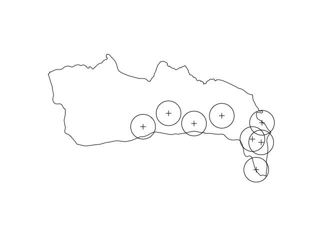

``` r
# extract the landuse data for each buffer
vil1_circle<-polygons(cs1)
landcover_vil1<-crop(landuse_nan,vil1_circle)

vil2_circle<-polygons(cs2)
landcover_vil2<-crop(landuse_nan,vil2_circle)

vil3_circle<-polygons(cs3)
landcover_vil3<-crop(landuse_nan,vil3_circle)

vil4_circle<-polygons(cs4)
landcover_vil4<-crop(landuse_nan,vil4_circle)

vil5_circle<-polygons(cs5)
landcover_vil5<-crop(landuse_nan,vil5_circle)

vil6_circle<-polygons(cs6)
landcover_vil6<-crop(landuse_nan,vil6_circle)

vil7_circle<-polygons(cs7)
landcover_vil7<-crop(landuse_nan,vil7_circle)

vil8_circle<-polygons(cs8)
landcover_vil8<-crop(landuse_nan,vil8_circle)


# extract patches, area, perimeter, perimeter to area ... 
# using the package SDMTools
# metadata for patchID is given in "Globcover2009_Legend.xls"
ps.data.1 = PatchStat(landcover_vil1)
ps.data.2 = PatchStat(landcover_vil2)
ps.data.3 = PatchStat(landcover_vil3)
ps.data.4 = PatchStat(landcover_vil4)
ps.data.5 = PatchStat(landcover_vil5)
ps.data.6 = PatchStat(landcover_vil6)
ps.data.7 = PatchStat(landcover_vil7)
ps.data.8 = PatchStat(landcover_vil8)

ps.data.1
```

    ##   patchID n.cell n.core.cell n.edges.perimeter n.edges.internal area
    ## 1      14     40          18                26              134   40
    ## 2      20      2           0                 6                2    2
    ##   core.area perimeter perim.area.ratio shape.index frac.dim.index
    ## 1        18        26             0.65           1       1.014835
    ## 2         0         6             3.00           1       1.169925
    ##   core.area.index
    ## 1            0.45
    ## 2            0.00

``` r
ps.data.2
```

    ##   patchID n.cell n.core.cell n.edges.perimeter n.edges.internal area
    ## 1      14     35          15                24              116   35
    ## 2      30      1           0                 4                0    1
    ##   core.area perimeter perim.area.ratio shape.index frac.dim.index
    ## 1        15        24        0.6857143           1       1.007924
    ## 2         0         4        4.0000000           1            NaN
    ##   core.area.index
    ## 1       0.4285714
    ## 2       0.0000000

``` r
ps.data.3
```

    ##   patchID n.cell n.core.cell n.edges.perimeter n.edges.internal area
    ## 1      14     29           9                28               88   29
    ## 2      20      7           0                16               12    7
    ## 3      30      6           0                12               12    6
    ##   core.area perimeter perim.area.ratio shape.index frac.dim.index
    ## 1         9        28        0.9655172    1.272727       1.155770
    ## 2         0        16        2.2857143    1.333333       1.424829
    ## 3         0        12        2.0000000    1.200000       1.226294
    ##   core.area.index
    ## 1       0.3103448
    ## 2       0.0000000
    ## 3       0.0000000

``` r
ps.data.4
```

    ##   patchID n.cell n.core.cell n.edges.perimeter n.edges.internal area
    ## 1      14     15           0                22               38   15
    ## 2      20     13           0                34               18   13
    ## 3      30      6           0                18                6    6
    ## 4      40      1           0                 4                0    1
    ## 5     100      3           0                 8                4    3
    ## 6     130      4           0                12                4    4
    ##   core.area perimeter perim.area.ratio shape.index frac.dim.index
    ## 1         0        22         1.466667       1.375       1.259023
    ## 2         0        34         2.615385       2.125       1.668701
    ## 3         0        18         3.000000       1.800       1.678883
    ## 4         0         4         4.000000       1.000            NaN
    ## 5         0         8         2.666667       1.000       1.261860
    ## 6         0        12         3.000000       1.500       1.584963
    ##   core.area.index
    ## 1               0
    ## 2               0
    ## 3               0
    ## 4               0
    ## 5               0
    ## 6               0

``` r
ps.data.5
```

    ##   patchID n.cell n.core.cell n.edges.perimeter n.edges.internal area
    ## 1      20      2           0                 8                0    2
    ## 2      30      6           0                16                8    6
    ## 3      40     11           0                24               20   11
    ## 4     100      4           0                12                4    4
    ## 5     130     19           0                36               40   19
    ##   core.area perimeter perim.area.ratio shape.index frac.dim.index
    ## 1         0         8         4.000000    1.333333       2.000000
    ## 2         0        16         2.666667    1.600000       1.547411
    ## 3         0        24         2.181818    1.714286       1.494443
    ## 4         0        12         3.000000    1.500000       1.584963
    ## 5         0        36         1.894737    2.000000       1.492457
    ##   core.area.index
    ## 1               0
    ## 2               0
    ## 3               0
    ## 4               0
    ## 5               0

``` r
ps.data.6
```

    ##   patchID n.cell n.core.cell n.edges.perimeter n.edges.internal area
    ## 1      14      2           0                 8                0    2
    ## 2      20      9           0                14               22    9
    ## 3      40     21           2                34               50   21
    ## 4     130     17           0                42               26   17
    ##   core.area perimeter perim.area.ratio shape.index frac.dim.index
    ## 1         0         8         4.000000    1.333333       2.000000
    ## 2         0        14         1.555556    1.166667       1.140314
    ## 3         2        34         1.619048    1.700000       1.405847
    ## 4         0        42         2.470588    2.333333       1.659865
    ##   core.area.index
    ## 1       0.0000000
    ## 2       0.0000000
    ## 3       0.0952381
    ## 4       0.0000000

``` r
ps.data.7
```

    ##   patchID n.cell n.core.cell n.edges.perimeter n.edges.internal area
    ## 1      30      3           0                 8                4    3
    ## 2      40     18           0                28               44   18
    ## 3     130     21           0                36               48   21
    ##   core.area perimeter perim.area.ratio shape.index frac.dim.index
    ## 1         0         8         2.666667    1.000000       1.261860
    ## 2         0        28         1.555556    1.555556       1.346477
    ## 3         0        36         1.714286    1.800000       1.443395
    ##   core.area.index
    ## 1               0
    ## 2               0
    ## 3               0

``` r
ps.data.8
```

    ##   patchID n.cell n.core.cell n.edges.perimeter n.edges.internal area
    ## 1      14     42          20                26              142   42
    ##   core.area perimeter perim.area.ratio shape.index frac.dim.index
    ## 1        20        26        0.6190476           1       1.001588
    ##   core.area.index
    ## 1       0.4761905

``` r
############
#####
### plot your maps
# fix / choose colors using function rasterTheme from library rasterVis
mapTheme <- rasterTheme(region=brewer.pal(8,"Greens"))

# landuse of Nan using rasterVis
planduse<-levelplot(landuse_nan,margin=F, par.settings=mapTheme,
                    sub = expression("Land USe"), 
                    xlab = NULL, ylab = NULL)+ 
  layer(sp.lines(thawangpha, col="black", lwd=0.5))+ 
  layer(sp.lines(thai_nan_st, col="black", lwd=0.5))+
  layer(sp.lines(vil1_circle, col="black", lwd=2))+
  layer(sp.points(village_1, col="red", lwd=2))
planduse
```

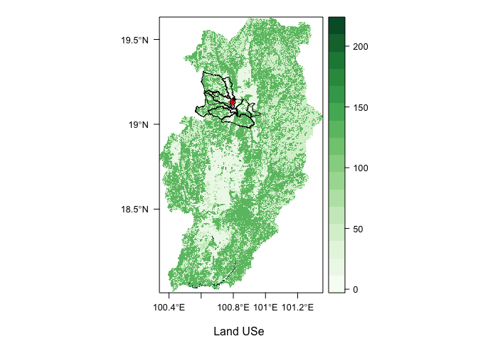

``` r
# landuse of Thawangpha with villages and buffers using rasterVis
planduse_twp<-levelplot(landuse_nan_twp_m,margin=F, par.settings=mapTheme,
                    sub = expression("Land Use Thawangpha"), 
                    xlab = NULL, ylab = NULL)+
  layer(sp.lines(thai_nan_st, col="black", lwd=1))+
  layer(sp.lines(vil1_circle, col="black", lwd=2))+
  layer(sp.lines(vil2_circle, col="black", lwd=2))+
  layer(sp.lines(vil3_circle, col="black", lwd=2))+
  layer(sp.lines(vil4_circle, col="black", lwd=2))+
  layer(sp.lines(vil5_circle, col="black", lwd=2))+
  layer(sp.lines(vil6_circle, col="black", lwd=2))+
  layer(sp.lines(vil7_circle, col="black", lwd=2))+
  layer(sp.lines(vil7_circle, col="black", lwd=2))+
  layer(sp.lines(vil8_circle, col="black", lwd=2))+
  layer(sp.points(village_st, col="red", lwd=2))
planduse_twp
```

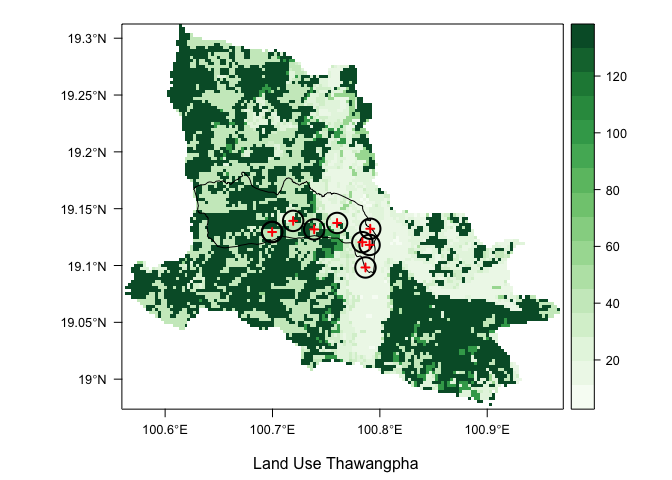

``` r
## elevation map
# change the color to a range of greys
mapTheme <- rasterTheme(region=brewer.pal(9,"Greys"))

# elevation map of Thawangpha
pdem<-levelplot(hill.raster_thawangpha,margin=F, par.settings=mapTheme,
                    sub = expression(" "), 
                    xlab = NULL, ylab = NULL)+ 
  layer(sp.lines(thai_nan, col="black", lwd=0.5))+ 
  layer(sp.lines(thai_nan_st, col="black", lwd=0.5))+
  layer(sp.lines(vil1_circle, col="black", lwd=2))+
  layer(sp.points(village_1, col="red", lwd=2))
pdem
```

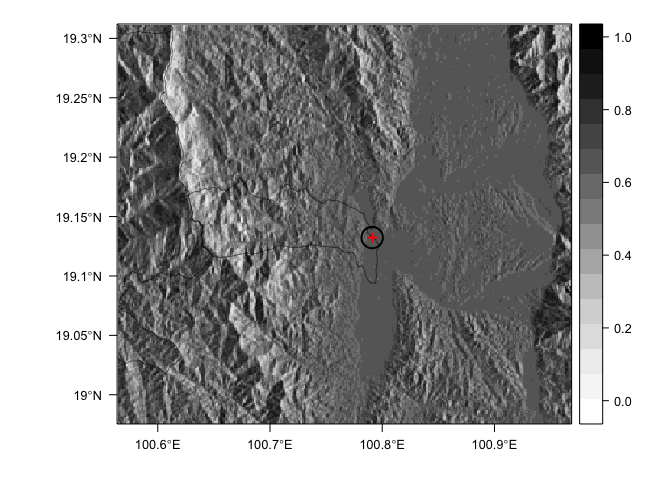

The land use of Nan with Thawangpha district boundaries (and subdistricts) and position of Ban Na Non (village 1 of Saen Thong district)
----------------------------------------------------------------------------------------------------------------------------------------


Note that the `echo = FALSE` parameter was added to the code chunk to prevent printing of the R code that generated the plot.
